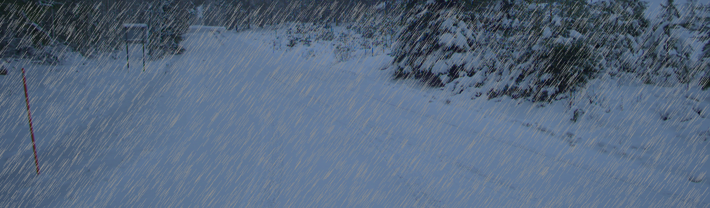

### Albumentations

As I wrote about in the [week 3 blogpost](../weekly/week3/week3.md), Albumentations is a library for creating image augmentation pipelines. It has all of the basic augmentations like cropping, rotating, saturation, blurs, and also weather related effects like snow, rain, fog, and sun flares.

While the library is meant to be stochastic, there is a way of specifying exactly the amount of noise you want using `functional transforms`. These are pure functions and will produce the same output given the same input.

For instance, with the function `add_rain` you can specify the slant of the rain drops, exactly where the rain drops will end up, the color, width, and length of the rain drops. It's also possible to change the blurriness and the brightness of the image.

I used this `yaml` file to generate different variations of rainy images in albumentations.

```yaml
randomness_seed: 5
rain:
  droplet_share: [0.0001, 0.01, 5]
  slant: -15
  drop_length : 20
  drop_width : 1
  drop_color : [200, 200, 200]
  blur_value : [1, 6, 5]
  brightness_coefficient : 0.7
```

`droplet_share` is here `number of droplets / number of pixels`. Note that more pixels than `droplet_share` will be covered as one droplet can take up more than one pixel.

For each list, the first value is the min, the second is the max, and the third value is the number of elements `n` in the calculation `np.linspace(min, max, n)`, i.e. the number of linearly spaced elements in the range `[min, max]`. 

I load in this `yaml` file and generate all possible combinations of the configurations (which in this case is 25). I then run `add_rain` for each configuration which gives the results that can be seen [here](albumentations_results.md)

The results are okay in my opinion. The library simulates rain pretty well even if it looks a bit uniform and painted on. It would be nice if you could have differently sized raindrops but to my knowledge, that isn't possible with this library.


Example image from the results.

### What's next?
Now that the image distortion code works well I'm thinking about what to do next.

I could look more into other image augmentation libraries but I don't think it will a very fruitful search. Most people in the CV community seems to use Albumentations or Imgaug (which has basically the same functionality).

Another option is to generate a larger dataset where the ranking among the images is known. I could for instance create 100 images starting with really low droplet_share and increase it for every image. I could also change some of the other parameters in `add_rain` like `brightness_coefficient`. This way I would get a dataset where the ranking of images is known. I can then run each IQA metric on this dataset and compare an ordering of the scores to the known ranking.