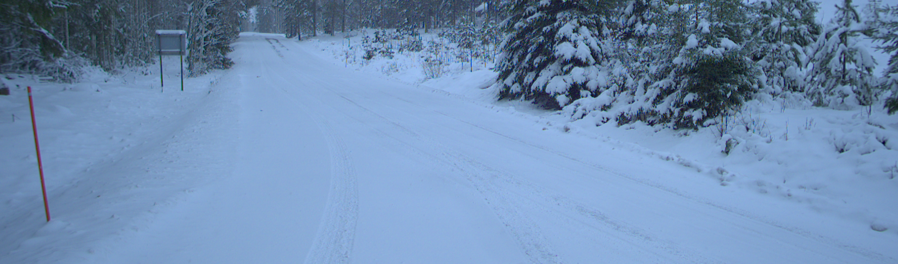
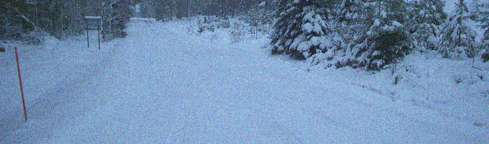
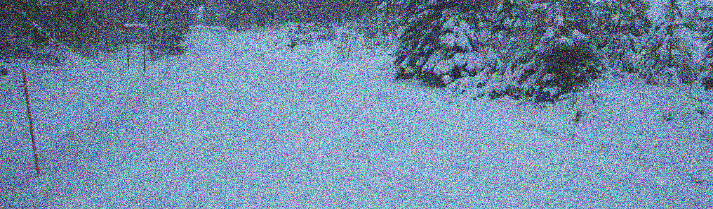

### Evaluating pyiqa metrics

Now that I've got pyiqa metrics working I need to find a good way of evaluating them. One approach of evaluating the metrics is to take an image, create corrupted/distorted versions of the image, and then run the metrics on each of the distorted images. This way, it's possible to see how the score is affected by worsening the quality.

[imagecorruptions](https://github.com/bethgelab/imagecorruptions) is a library in python that can artificially add various kinds of noise to images. It has gaussian noise, motion blur, defocus blur, and a few more. The library is good to create distortions but its fundamental flaw is that the distortions have to specified on a 1-5 scale. Thus, from a generic image, it's only possible to get 5 versions of it with various levels of distortions. This is not great since we would ideally like to be able to have 100 or 1000 images with varying levels of distortion and see how that affects the metric scores.

In the future, it might be good to modify the library to handle more levels but we'll make due with the 5 levels for now.

I wrote some code that for three types of distortions (gaussian noise, motion blur, defocus blur) generates 5 distorted images for each distortion type with the level ranging from 1-5. Below are 6 images, the first without any noise and the other 5 with gaussian noise distortions going from best to worst. The remaining distorted images can be found [here](https://github.com/Stenmarken/image-quality-assessment/tree/main/test-pyiqa/corrupted).

|  | 
|:--:| 
| **1.png** |

|  | 
|:--:| 
| **1.png_gaussian_noise_1.png** |

|  | 
|:--:| 
| **1.png_gaussian_noise_2.png** |

|  | 
|:--:| 
| **1.png_gaussian_noise_3.png** |

|  | 
|:--:| 
| **1.png_gaussian_noise_4.png** |

|  | 
|:--:| 
| **1.png_gaussian_noise_5.png** |

With the distorted images I then run every available metric that I could get working and see what the score is. The results can be found below:

```json
{
    "ilniqe": {
        "1.png_uncorrupted_0.png": 25.65188834129181,
        "1.png_gaussian_noise_1.png": 40.40594025586812,
        "1.png_gaussian_noise_2.png": 50.41788810037335,
        "1.png_gaussian_noise_3.png": 59.04275313821976,
        "1.png_gaussian_noise_4.png": 72.02718835006128,
        "1.png_gaussian_noise_5.png": 98.0609728142452,
        "1.png_motion_blur_1.png": 27.66563041116335,
        "1.png_motion_blur_2.png": 26.564103007033378,
        "1.png_motion_blur_3.png": 34.8947861606125,
        "1.png_motion_blur_4.png": 41.26029602117231,
        "1.png_motion_blur_5.png": 44.100097211889306,
        "1.png_defocus_blur_1.png": 33.38073836791299,
        "1.png_defocus_blur_2.png": 38.54175429156431,
        "1.png_defocus_blur_3.png": 55.60324797288998,
        "1.png_defocus_blur_4.png": 71.84530253623439,
        "1.png_defocus_blur_5.png": 82.47771580157435
    },
    "hyperiqa": {
        "1.png_uncorrupted_0.png": 0.43821579217910767,
        "1.png_gaussian_noise_1.png": 0.31054961681365967,
        "1.png_gaussian_noise_2.png": 0.29813292622566223,
        "1.png_gaussian_noise_3.png": 0.29843249917030334,
        "1.png_gaussian_noise_4.png": 0.25965648889541626,
        "1.png_gaussian_noise_5.png": 0.2593971788883209,
        "1.png_motion_blur_1.png": 0.41904059052467346,
        "1.png_motion_blur_2.png": 0.4067612886428833,
        "1.png_motion_blur_3.png": 0.4096779525279999,
        "1.png_motion_blur_4.png": 0.3957338333129883,
        "1.png_motion_blur_5.png": 0.3789760172367096,
        "1.png_defocus_blur_1.png": 0.3695529103279114,
        "1.png_defocus_blur_2.png": 0.3665699362754822,
        "1.png_defocus_blur_3.png": 0.3904345631599426,
        "1.png_defocus_blur_4.png": 0.4068112075328827,
        "1.png_defocus_blur_5.png": 0.414253830909729
    },
    "arniqa-clive": {
        "1.png_uncorrupted_0.png": 0.5729267001152039,
        "1.png_gaussian_noise_1.png": 0.6558530330657959,
        "1.png_gaussian_noise_2.png": 0.7765876054763794,
        "1.png_gaussian_noise_3.png": 0.9737045764923096,
        "1.png_gaussian_noise_4.png": 0.869957685470581,
        "1.png_gaussian_noise_5.png": 0.7574289441108704,
        "1.png_motion_blur_1.png": 0.28360772132873535,
        "1.png_motion_blur_2.png": 0.27505993843078613,
        "1.png_motion_blur_3.png": 0.2214866578578949,
        "1.png_motion_blur_4.png": 0.11200983822345734,
        "1.png_motion_blur_5.png": 0.10727926343679428,
        "1.png_defocus_blur_1.png": 0.11681924760341644,
        "1.png_defocus_blur_2.png": -0.010088024660944939,
        "1.png_defocus_blur_3.png": 0.023613130673766136,
        "1.png_defocus_blur_4.png": 0.10050343722105026,
        "1.png_defocus_blur_5.png": 0.1823408305644989
    },
    "arniqa-csiq": {
        "1.png_uncorrupted_0.png": 0.7367212772369385,
        "1.png_gaussian_noise_1.png": 0.5317790508270264,
        "1.png_gaussian_noise_2.png": 0.4929199814796448,
        "1.png_gaussian_noise_3.png": 0.445841908454895,
        "1.png_gaussian_noise_4.png": 0.4250184893608093,
        "1.png_gaussian_noise_5.png": 0.41419529914855957,
        "1.png_motion_blur_1.png": 0.5579217672348022,
        "1.png_motion_blur_2.png": 0.47556304931640625,
        "1.png_motion_blur_3.png": 0.4135664701461792,
        "1.png_motion_blur_4.png": 0.4256287217140198,
        "1.png_motion_blur_5.png": 0.408846378326416,
        "1.png_defocus_blur_1.png": 0.4589422345161438,
        "1.png_defocus_blur_2.png": 0.40075695514678955,
        "1.png_defocus_blur_3.png": 0.34308552742004395,
        "1.png_defocus_blur_4.png": 0.298597514629364,
        "1.png_defocus_blur_5.png": 0.25843411684036255
    },
    "arniqa-flive": {
        "1.png_uncorrupted_0.png": 0.6762859225273132,
        "1.png_gaussian_noise_1.png": 0.6262153387069702,
        "1.png_gaussian_noise_2.png": 0.5454601645469666,
        "1.png_gaussian_noise_3.png": 0.5386384129524231,
        "1.png_gaussian_noise_4.png": 0.5967354774475098,
        "1.png_gaussian_noise_5.png": 0.6418974995613098,
        "1.png_motion_blur_1.png": 0.5482088923454285,
        "1.png_motion_blur_2.png": 0.3801397383213043,
        "1.png_motion_blur_3.png": 0.22332671284675598,
        "1.png_motion_blur_4.png": 0.2162563055753708,
        "1.png_motion_blur_5.png": 0.19651509821414948,
        "1.png_defocus_blur_1.png": 0.5131790637969971,
        "1.png_defocus_blur_2.png": 0.48184719681739807,
        "1.png_defocus_blur_3.png": 0.46469274163246155,
        "1.png_defocus_blur_4.png": 0.4163329005241394,
        "1.png_defocus_blur_5.png": 0.3376304805278778
    },
    "arniqa-kadid": {
        "1.png_uncorrupted_0.png": 0.46753084659576416,
        "1.png_gaussian_noise_1.png": 0.27527809143066406,
        "1.png_gaussian_noise_2.png": 0.17390713095664978,
        "1.png_gaussian_noise_3.png": 0.09586536884307861,
        "1.png_gaussian_noise_4.png": 0.06239652633666992,
        "1.png_gaussian_noise_5.png": 0.07814192771911621,
        "1.png_motion_blur_1.png": 0.2881990671157837,
        "1.png_motion_blur_2.png": 0.25221681594848633,
        "1.png_motion_blur_3.png": 0.15477564930915833,
        "1.png_motion_blur_4.png": 0.15790852904319763,
        "1.png_motion_blur_5.png": 0.14701586961746216,
        "1.png_defocus_blur_1.png": 0.24163109064102173,
        "1.png_defocus_blur_2.png": 0.18196746706962585,
        "1.png_defocus_blur_3.png": 0.13175523281097412,
        "1.png_defocus_blur_4.png": 0.1068108081817627,
        "1.png_defocus_blur_5.png": 0.09185177087783813
    },
    "arniqa-live": {
        "1.png_uncorrupted_0.png": 0.7092715501785278,
        "1.png_gaussian_noise_1.png": 0.4255262613296509,
        "1.png_gaussian_noise_2.png": 0.3695675730705261,
        "1.png_gaussian_noise_3.png": 0.2852542996406555,
        "1.png_gaussian_noise_4.png": 0.204279363155365,
        "1.png_gaussian_noise_5.png": 0.11475735902786255,
        "1.png_motion_blur_1.png": 0.533257246017456,
        "1.png_motion_blur_2.png": 0.4412383437156677,
        "1.png_motion_blur_3.png": 0.3824949264526367,
        "1.png_motion_blur_4.png": 0.390079140663147,
        "1.png_motion_blur_5.png": 0.37977683544158936,
        "1.png_defocus_blur_1.png": 0.4518700838088989,
        "1.png_defocus_blur_2.png": 0.3870483636856079,
        "1.png_defocus_blur_3.png": 0.30542391538619995,
        "1.png_defocus_blur_4.png": 0.2597748637199402,
        "1.png_defocus_blur_5.png": 0.2376195788383484
    },
    "arniqa-spaq": {
        "1.png_uncorrupted_0.png": 0.6056326031684875,
        "1.png_gaussian_noise_1.png": 0.7505223155021667,
        "1.png_gaussian_noise_2.png": 0.8189527988433838,
        "1.png_gaussian_noise_3.png": 0.7517553567886353,
        "1.png_gaussian_noise_4.png": 0.7319545745849609,
        "1.png_gaussian_noise_5.png": 0.7557192444801331,
        "1.png_motion_blur_1.png": 0.4078957140445709,
        "1.png_motion_blur_2.png": 0.3371163606643677,
        "1.png_motion_blur_3.png": 0.25885194540023804,
        "1.png_motion_blur_4.png": 0.2241785228252411,
        "1.png_motion_blur_5.png": 0.21889148652553558,
        "1.png_defocus_blur_1.png": 0.332492858171463,
        "1.png_defocus_blur_2.png": 0.27563726902008057,
        "1.png_defocus_blur_3.png": 0.26019275188446045,
        "1.png_defocus_blur_4.png": 0.21256786584854126,
        "1.png_defocus_blur_5.png": 0.16451163589954376
    },
    "arniqa-tid": {
        "1.png_uncorrupted_0.png": 0.4323219656944275,
        "1.png_gaussian_noise_1.png": 0.35419368743896484,
        "1.png_gaussian_noise_2.png": 0.2545319199562073,
        "1.png_gaussian_noise_3.png": 0.18251265585422516,
        "1.png_gaussian_noise_4.png": 0.23179350793361664,
        "1.png_gaussian_noise_5.png": 0.27875199913978577,
        "1.png_motion_blur_1.png": 0.4441887438297272,
        "1.png_motion_blur_2.png": 0.36509981751441956,
        "1.png_motion_blur_3.png": 0.2822655141353607,
        "1.png_motion_blur_4.png": 0.3333698809146881,
        "1.png_motion_blur_5.png": 0.32263875007629395,
        "1.png_defocus_blur_1.png": 0.36241021752357483,
        "1.png_defocus_blur_2.png": 0.326125830411911,
        "1.png_defocus_blur_3.png": 0.278460294008255,
        "1.png_defocus_blur_4.png": 0.23338410258293152,
        "1.png_defocus_blur_5.png": 0.19951380789279938
    },
    "brisque_matlab": {
        "1.png_uncorrupted_0.png": 24.602569580078125,
        "1.png_gaussian_noise_1.png": 42.3999137878418,
        "1.png_gaussian_noise_2.png": 44.85131072998047,
        "1.png_gaussian_noise_3.png": 48.2923469543457,
        "1.png_gaussian_noise_4.png": 49.723236083984375,
        "1.png_gaussian_noise_5.png": 51.24897766113281,
        "1.png_motion_blur_1.png": 30.079627990722656,
        "1.png_motion_blur_2.png": 37.41180419921875,
        "1.png_motion_blur_3.png": 40.359012603759766,
        "1.png_motion_blur_4.png": 32.01674270629883,
        "1.png_motion_blur_5.png": 33.035728454589844,
        "1.png_defocus_blur_1.png": 44.435630798339844,
        "1.png_defocus_blur_2.png": 54.17680358886719,
        "1.png_defocus_blur_3.png": 54.96907043457031,
        "1.png_defocus_blur_4.png": 53.26294708251953,
        "1.png_defocus_blur_5.png": 50.890018463134766
    },
    "clipiqa": {
        "1.png_uncorrupted_0.png": 0.37460941076278687,
        "1.png_gaussian_noise_1.png": 0.3908390998840332,
        "1.png_gaussian_noise_2.png": 0.377187043428421,
        "1.png_gaussian_noise_3.png": 0.5136854648590088,
        "1.png_gaussian_noise_4.png": 0.5927115082740784,
        "1.png_gaussian_noise_5.png": 0.6464663743972778,
        "1.png_motion_blur_1.png": 0.21560421586036682,
        "1.png_motion_blur_2.png": 0.2073991298675537,
        "1.png_motion_blur_3.png": 0.19209697842597961,
        "1.png_motion_blur_4.png": 0.2397160530090332,
        "1.png_motion_blur_5.png": 0.2528561055660248,
        "1.png_defocus_blur_1.png": 0.342801570892334,
        "1.png_defocus_blur_2.png": 0.3558558225631714,
        "1.png_defocus_blur_3.png": 0.38664600253105164,
        "1.png_defocus_blur_4.png": 0.3968238830566406,
        "1.png_defocus_blur_5.png": 0.4325413107872009
    },
    "clipiqa+": {
        "1.png_uncorrupted_0.png": 0.5478935837745667,
        "1.png_gaussian_noise_1.png": 0.3794879615306854,
        "1.png_gaussian_noise_2.png": 0.34584081172943115,
        "1.png_gaussian_noise_3.png": 0.36721909046173096,
        "1.png_gaussian_noise_4.png": 0.3936622738838196,
        "1.png_gaussian_noise_5.png": 0.4381103813648224,
        "1.png_motion_blur_1.png": 0.36932018399238586,
        "1.png_motion_blur_2.png": 0.3566814363002777,
        "1.png_motion_blur_3.png": 0.31443485617637634,
        "1.png_motion_blur_4.png": 0.28321534395217896,
        "1.png_motion_blur_5.png": 0.2742410898208618,
        "1.png_defocus_blur_1.png": 0.443359375,
        "1.png_defocus_blur_2.png": 0.44031625986099243,
        "1.png_defocus_blur_3.png": 0.400434285402298,
        "1.png_defocus_blur_4.png": 0.354803204536438,
        "1.png_defocus_blur_5.png": 0.3525915741920471
    },
    "clipiqa+_rn50_512": {
        "1.png_uncorrupted_0.png": 0.3291867673397064,
        "1.png_gaussian_noise_1.png": 0.23662802577018738,
        "1.png_gaussian_noise_2.png": 0.22661176323890686,
        "1.png_gaussian_noise_3.png": 0.2884216904640198,
        "1.png_gaussian_noise_4.png": 0.35074207186698914,
        "1.png_gaussian_noise_5.png": 0.4182833135128021,
        "1.png_motion_blur_1.png": 0.2104748636484146,
        "1.png_motion_blur_2.png": 0.18082797527313232,
        "1.png_motion_blur_3.png": 0.1684156060218811,
        "1.png_motion_blur_4.png": 0.19649896025657654,
        "1.png_motion_blur_5.png": 0.1973421573638916,
        "1.png_defocus_blur_1.png": 0.20605091750621796,
        "1.png_defocus_blur_2.png": 0.21088436245918274,
        "1.png_defocus_blur_3.png": 0.21176746487617493,
        "1.png_defocus_blur_4.png": 0.21738488972187042,
        "1.png_defocus_blur_5.png": 0.23952841758728027
    },
    "dbcnn": {
        "1.png_uncorrupted_0.png": 0.46815893054008484,
        "1.png_gaussian_noise_1.png": 0.37289538979530334,
        "1.png_gaussian_noise_2.png": 0.3700868785381317,
        "1.png_gaussian_noise_3.png": 0.3712235689163208,
        "1.png_gaussian_noise_4.png": 0.38204625248908997,
        "1.png_gaussian_noise_5.png": 0.39383798837661743,
        "1.png_motion_blur_1.png": 0.3294583261013031,
        "1.png_motion_blur_2.png": 0.29425251483917236,
        "1.png_motion_blur_3.png": 0.27098163962364197,
        "1.png_motion_blur_4.png": 0.29022276401519775,
        "1.png_motion_blur_5.png": 0.297600656747818,
        "1.png_defocus_blur_1.png": 0.3000214397907257,
        "1.png_defocus_blur_2.png": 0.2810029983520508,
        "1.png_defocus_blur_3.png": 0.2801622152328491,
        "1.png_defocus_blur_4.png": 0.2888447642326355,
        "1.png_defocus_blur_5.png": 0.2919293940067291
    },
    "cnniqa": {
        "1.png_uncorrupted_0.png": 0.4637420177459717,
        "1.png_gaussian_noise_1.png": 0.5577658414840698,
        "1.png_gaussian_noise_2.png": 0.6665040254592896,
        "1.png_gaussian_noise_3.png": 0.6814426779747009,
        "1.png_gaussian_noise_4.png": 0.7101565599441528,
        "1.png_gaussian_noise_5.png": 0.6681232452392578,
        "1.png_motion_blur_1.png": 0.35752490162849426,
        "1.png_motion_blur_2.png": 0.3340110778808594,
        "1.png_motion_blur_3.png": 0.31386011838912964,
        "1.png_motion_blur_4.png": 0.33918899297714233,
        "1.png_motion_blur_5.png": 0.3408256769180298,
        "1.png_defocus_blur_1.png": 0.2816343307495117,
        "1.png_defocus_blur_2.png": 0.26422765851020813,
        "1.png_defocus_blur_3.png": 0.25335031747817993,
        "1.png_defocus_blur_4.png": 0.26626482605934143,
        "1.png_defocus_blur_5.png": 0.2734147012233734
    },
    "liqe": {
        "1.png_uncorrupted_0.png": 1.6278308629989624,
        "1.png_gaussian_noise_1.png": 1.039383888244629,
        "1.png_gaussian_noise_2.png": 1.017709732055664,
        "1.png_gaussian_noise_3.png": 1.0204105377197266,
        "1.png_gaussian_noise_4.png": 1.0251376628875732,
        "1.png_gaussian_noise_5.png": 1.029671549797058,
        "1.png_motion_blur_1.png": 1.0588264465332031,
        "1.png_motion_blur_2.png": 1.0351738929748535,
        "1.png_motion_blur_3.png": 1.0325803756713867,
        "1.png_motion_blur_4.png": 1.0245176553726196,
        "1.png_motion_blur_5.png": 1.0260074138641357,
        "1.png_defocus_blur_1.png": 1.0403785705566406,
        "1.png_defocus_blur_2.png": 1.048183798789978,
        "1.png_defocus_blur_3.png": 1.0882128477096558,
        "1.png_defocus_blur_4.png": 1.1182259321212769,
        "1.png_defocus_blur_5.png": 1.1398605108261108
    },
    "liqe_mix": {
        "1.png_uncorrupted_0.png": 4.550300121307373,
        "1.png_gaussian_noise_1.png": 2.041407346725464,
        "1.png_gaussian_noise_2.png": 1.543736457824707,
        "1.png_gaussian_noise_3.png": 1.1604928970336914,
        "1.png_gaussian_noise_4.png": 1.030396819114685,
        "1.png_gaussian_noise_5.png": 1.0031251907348633,
        "1.png_motion_blur_1.png": 2.8495798110961914,
        "1.png_motion_blur_2.png": 2.2515316009521484,
        "1.png_motion_blur_3.png": 1.345909833908081,
        "1.png_motion_blur_4.png": 1.0274763107299805,
        "1.png_motion_blur_5.png": 1.0125759840011597,
        "1.png_defocus_blur_1.png": 2.140852451324463,
        "1.png_defocus_blur_2.png": 1.636322259902954,
        "1.png_defocus_blur_3.png": 1.2839834690093994,
        "1.png_defocus_blur_4.png": 1.1358925104141235,
        "1.png_defocus_blur_5.png": 1.097502589225769
    },
    "maniqa": {
        "1.png_uncorrupted_0.png": 0.3154112696647644,
        "1.png_gaussian_noise_1.png": 0.2010028213262558,
        "1.png_gaussian_noise_2.png": 0.20443987846374512,
        "1.png_gaussian_noise_3.png": 0.2006894201040268,
        "1.png_gaussian_noise_4.png": 0.22551394999027252,
        "1.png_gaussian_noise_5.png": 0.2750052809715271,
        "1.png_motion_blur_1.png": 0.22183503210544586,
        "1.png_motion_blur_2.png": 0.196275994181633,
        "1.png_motion_blur_3.png": 0.19412699341773987,
        "1.png_motion_blur_4.png": 0.1865786761045456,
        "1.png_motion_blur_5.png": 0.19148199260234833,
        "1.png_defocus_blur_1.png": 0.2503417730331421,
        "1.png_defocus_blur_2.png": 0.24589213728904724,
        "1.png_defocus_blur_3.png": 0.2483578771352768,
        "1.png_defocus_blur_4.png": 0.2657102942466736,
        "1.png_defocus_blur_5.png": 0.29065799713134766
    },
    "maniqa-kadid": {
        "1.png_uncorrupted_0.png": 0.5586414933204651,
        "1.png_gaussian_noise_1.png": 0.27527379989624023,
        "1.png_gaussian_noise_2.png": 0.2103288471698761,
        "1.png_gaussian_noise_3.png": 0.1577368974685669,
        "1.png_gaussian_noise_4.png": 0.1340731978416443,
        "1.png_gaussian_noise_5.png": 0.12943391501903534,
        "1.png_motion_blur_1.png": 0.35980406403541565,
        "1.png_motion_blur_2.png": 0.28791898488998413,
        "1.png_motion_blur_3.png": 0.2404661327600479,
        "1.png_motion_blur_4.png": 0.21376283466815948,
        "1.png_motion_blur_5.png": 0.21200594305992126,
        "1.png_defocus_blur_1.png": 0.2585351765155792,
        "1.png_defocus_blur_2.png": 0.1929847002029419,
        "1.png_defocus_blur_3.png": 0.13008184731006622,
        "1.png_defocus_blur_4.png": 0.11479167640209198,
        "1.png_defocus_blur_5.png": 0.11413788795471191
    },
    "maniqa-pipal": {
        "1.png_uncorrupted_0.png": 0.5287140607833862,
        "1.png_gaussian_noise_1.png": 0.36358940601348877,
        "1.png_gaussian_noise_2.png": 0.32297483086586,
        "1.png_gaussian_noise_3.png": 0.28759390115737915,
        "1.png_gaussian_noise_4.png": 0.2700079679489136,
        "1.png_gaussian_noise_5.png": 0.27967631816864014,
        "1.png_motion_blur_1.png": 0.46590936183929443,
        "1.png_motion_blur_2.png": 0.4137265980243683,
        "1.png_motion_blur_3.png": 0.35833925008773804,
        "1.png_motion_blur_4.png": 0.37509989738464355,
        "1.png_motion_blur_5.png": 0.3662654459476471,
        "1.png_defocus_blur_1.png": 0.41137874126434326,
        "1.png_defocus_blur_2.png": 0.3585926294326782,
        "1.png_defocus_blur_3.png": 0.30263152718544006,
        "1.png_defocus_blur_4.png": 0.2907275855541229,
        "1.png_defocus_blur_5.png": 0.28378745913505554
    },
    "nima": {
        "1.png_uncorrupted_0.png": 4.34726619720459,
        "1.png_gaussian_noise_1.png": 3.85638689994812,
        "1.png_gaussian_noise_2.png": 3.905430555343628,
        "1.png_gaussian_noise_3.png": 3.8252129554748535,
        "1.png_gaussian_noise_4.png": 4.079213619232178,
        "1.png_gaussian_noise_5.png": 4.004038333892822,
        "1.png_motion_blur_1.png": 3.8611302375793457,
        "1.png_motion_blur_2.png": 3.791686773300171,
        "1.png_motion_blur_3.png": 3.828953742980957,
        "1.png_motion_blur_4.png": 4.023499011993408,
        "1.png_motion_blur_5.png": 4.309994697570801,
        "1.png_defocus_blur_1.png": 3.5407052040100098,
        "1.png_defocus_blur_2.png": 3.664713144302368,
        "1.png_defocus_blur_3.png": 3.5085771083831787,
        "1.png_defocus_blur_4.png": 3.3743703365325928,
        "1.png_defocus_blur_5.png": 3.4581334590911865
    },
    "nima-koniq": {
        "1.png_uncorrupted_0.png": 0.5521291494369507,
        "1.png_gaussian_noise_1.png": 0.4653705954551697,
        "1.png_gaussian_noise_2.png": 0.4559033215045929,
        "1.png_gaussian_noise_3.png": 0.4624616205692291,
        "1.png_gaussian_noise_4.png": 0.4635399580001831,
        "1.png_gaussian_noise_5.png": 0.45781391859054565,
        "1.png_motion_blur_1.png": 0.43763503432273865,
        "1.png_motion_blur_2.png": 0.41067880392074585,
        "1.png_motion_blur_3.png": 0.3536417484283447,
        "1.png_motion_blur_4.png": 0.34804004430770874,
        "1.png_motion_blur_5.png": 0.3346053659915924,
        "1.png_defocus_blur_1.png": 0.4095831513404846,
        "1.png_defocus_blur_2.png": 0.37977954745292664,
        "1.png_defocus_blur_3.png": 0.3583093285560608,
        "1.png_defocus_blur_4.png": 0.3524523377418518,
        "1.png_defocus_blur_5.png": 0.34041768312454224
    },
    "nima-spaq": {
        "1.png_uncorrupted_0.png": 52.01961898803711,
        "1.png_gaussian_noise_1.png": 49.4997673034668,
        "1.png_gaussian_noise_2.png": 49.833534240722656,
        "1.png_gaussian_noise_3.png": 52.47331237792969,
        "1.png_gaussian_noise_4.png": 56.48722457885742,
        "1.png_gaussian_noise_5.png": 59.12442398071289,
        "1.png_motion_blur_1.png": 36.37849044799805,
        "1.png_motion_blur_2.png": 33.97395324707031,
        "1.png_motion_blur_3.png": 31.721939086914062,
        "1.png_motion_blur_4.png": 34.794578552246094,
        "1.png_motion_blur_5.png": 33.94541931152344,
        "1.png_defocus_blur_1.png": 32.542640686035156,
        "1.png_defocus_blur_2.png": 30.978607177734375,
        "1.png_defocus_blur_3.png": 32.522621154785156,
        "1.png_defocus_blur_4.png": 32.205665588378906,
        "1.png_defocus_blur_5.png": 30.204195022583008
    },
    "nima-vgg16-ava": {
        "1.png_uncorrupted_0.png": 4.585781574249268,
        "1.png_gaussian_noise_1.png": 4.468129634857178,
        "1.png_gaussian_noise_2.png": 4.238992691040039,
        "1.png_gaussian_noise_3.png": 3.8282957077026367,
        "1.png_gaussian_noise_4.png": 3.747128486633301,
        "1.png_gaussian_noise_5.png": 4.587040424346924,
        "1.png_motion_blur_1.png": 4.268113136291504,
        "1.png_motion_blur_2.png": 4.198314666748047,
        "1.png_motion_blur_3.png": 4.195493221282959,
        "1.png_motion_blur_4.png": 4.28851318359375,
        "1.png_motion_blur_5.png": 4.417638778686523,
        "1.png_defocus_blur_1.png": 3.7910211086273193,
        "1.png_defocus_blur_2.png": 3.468815326690674,
        "1.png_defocus_blur_3.png": 3.3426437377929688,
        "1.png_defocus_blur_4.png": 3.444600820541382,
        "1.png_defocus_blur_5.png": 3.353440046310425
    },
    "niqe": {
        "1.png_uncorrupted_0.png": 7.7814961349996326,
        "1.png_gaussian_noise_1.png": 8.334323358221567,
        "1.png_gaussian_noise_2.png": 10.841067982625379,
        "1.png_gaussian_noise_3.png": 13.157549012263244,
        "1.png_gaussian_noise_4.png": 16.44155237260517,
        "1.png_gaussian_noise_5.png": 21.620084705736385,
        "1.png_motion_blur_1.png": 5.134489694539827,
        "1.png_motion_blur_2.png": 5.464997016521562,
        "1.png_motion_blur_3.png": 5.442383266887335,
        "1.png_motion_blur_4.png": 7.043452242982685,
        "1.png_motion_blur_5.png": 7.567728692530234,
        "1.png_defocus_blur_1.png": 7.166056802137257,
        "1.png_defocus_blur_2.png": 8.336807845967385,
        "1.png_defocus_blur_3.png": 9.776038992077506,
        "1.png_defocus_blur_4.png": 10.476207780479472,
        "1.png_defocus_blur_5.png": 11.372698533921433
    },
    "niqe_matlab": {
        "1.png_uncorrupted_0.png": 8.074050325987194,
        "1.png_gaussian_noise_1.png": 9.453621203680756,
        "1.png_gaussian_noise_2.png": 12.224735712485232,
        "1.png_gaussian_noise_3.png": 14.868513826775581,
        "1.png_gaussian_noise_4.png": 18.580539183072517,
        "1.png_gaussian_noise_5.png": 24.138541063195547,
        "1.png_motion_blur_1.png": 4.543288124193154,
        "1.png_motion_blur_2.png": 4.812355777565378,
        "1.png_motion_blur_3.png": 4.6524907455492635,
        "1.png_motion_blur_4.png": 5.870695342577011,
        "1.png_motion_blur_5.png": 6.320184424769525,
        "1.png_defocus_blur_1.png": 5.460968313340967,
        "1.png_defocus_blur_2.png": 5.9691218221522195,
        "1.png_defocus_blur_3.png": 6.440591103025739,
        "1.png_defocus_blur_4.png": 6.516963920956769,
        "1.png_defocus_blur_5.png": 6.606324415072438
    },
    "nrqm": {
        "1.png_uncorrupted_0.png": 8.154705047607422,
        "1.png_gaussian_noise_1.png": 6.526552677154541,
        "1.png_gaussian_noise_2.png": 5.922448635101318,
        "1.png_gaussian_noise_3.png": 5.74644136428833,
        "1.png_gaussian_noise_4.png": 5.664458751678467,
        "1.png_gaussian_noise_5.png": 5.656213283538818,
        "1.png_motion_blur_1.png": 7.06507682800293,
        "1.png_motion_blur_2.png": 4.723105430603027,
        "1.png_motion_blur_3.png": 3.8552329540252686,
        "1.png_motion_blur_4.png": 4.216153144836426,
        "1.png_motion_blur_5.png": 3.794722080230713,
        "1.png_defocus_blur_1.png": 4.113577842712402,
        "1.png_defocus_blur_2.png": 3.0105912685394287,
        "1.png_defocus_blur_3.png": 2.514514923095703,
        "1.png_defocus_blur_4.png": 2.4412379264831543,
        "1.png_defocus_blur_5.png": 2.2675087451934814
    },
    "pi": {
        "1.png_uncorrupted_0.png": 4.384293532086321,
        "1.png_gaussian_noise_1.png": 5.309128628630714,
        "1.png_gaussian_noise_2.png": 6.891562268924151,
        "1.png_gaussian_noise_3.png": 8.515957670717546,
        "1.png_gaussian_noise_4.png": 10.162641258398656,
        "1.png_gaussian_noise_5.png": 12.835166632852907,
        "1.png_motion_blur_1.png": 4.2828138874424,
        "1.png_motion_blur_2.png": 5.304409729497419,
        "1.png_motion_blur_3.png": 5.881833871452763,
        "1.png_motion_blur_4.png": 6.536868524780273,
        "1.png_motion_blur_5.png": 6.848007487400322,
        "1.png_defocus_blur_1.png": 6.604574115400261,
        "1.png_defocus_blur_2.png": 7.594444651790588,
        "1.png_defocus_blur_3.png": 8.589296952529015,
        "1.png_defocus_blur_4.png": 8.95056487926346,
        "1.png_defocus_blur_5.png": 9.588618349496944
    },
    "piqe": {
        "1.png_uncorrupted_0.png": 11.993035316467285,
        "1.png_gaussian_noise_1.png": 63.981021881103516,
        "1.png_gaussian_noise_2.png": 69.00980377197266,
        "1.png_gaussian_noise_3.png": 72.72023010253906,
        "1.png_gaussian_noise_4.png": 75.36585235595703,
        "1.png_gaussian_noise_5.png": 77.41435241699219,
        "1.png_motion_blur_1.png": 30.017047882080078,
        "1.png_motion_blur_2.png": 61.23081970214844,
        "1.png_motion_blur_3.png": 72.69132232666016,
        "1.png_motion_blur_4.png": 26.11996841430664,
        "1.png_motion_blur_5.png": 22.648313522338867,
        "1.png_defocus_blur_1.png": 70.22294616699219,
        "1.png_defocus_blur_2.png": 73.72594451904297,
        "1.png_defocus_blur_3.png": 91.85699462890625,
        "1.png_defocus_blur_4.png": 100.0,
        "1.png_defocus_blur_5.png": 100.0
    },
    "topiq_iaa": {
        "1.png_uncorrupted_0.png": 4.659577369689941,
        "1.png_gaussian_noise_1.png": 3.8575966358184814,
        "1.png_gaussian_noise_2.png": 3.61572003364563,
        "1.png_gaussian_noise_3.png": 3.5749928951263428,
        "1.png_gaussian_noise_4.png": 3.18227219581604,
        "1.png_gaussian_noise_5.png": 3.119082450866699,
        "1.png_motion_blur_1.png": 4.299163341522217,
        "1.png_motion_blur_2.png": 4.04345703125,
        "1.png_motion_blur_3.png": 3.582594156265259,
        "1.png_motion_blur_4.png": 3.240471839904785,
        "1.png_motion_blur_5.png": 3.2510650157928467,
        "1.png_defocus_blur_1.png": 3.9107251167297363,
        "1.png_defocus_blur_2.png": 3.6587440967559814,
        "1.png_defocus_blur_3.png": 3.2141079902648926,
        "1.png_defocus_blur_4.png": 3.092773675918579,
        "1.png_defocus_blur_5.png": 3.1469032764434814
    },
    "topiq_iaa_res50": {
        "1.png_uncorrupted_0.png": 4.348024368286133,
        "1.png_gaussian_noise_1.png": 3.9348583221435547,
        "1.png_gaussian_noise_2.png": 3.8303263187408447,
        "1.png_gaussian_noise_3.png": 3.8865153789520264,
        "1.png_gaussian_noise_4.png": 3.7150659561157227,
        "1.png_gaussian_noise_5.png": 3.8658366203308105,
        "1.png_motion_blur_1.png": 3.9350297451019287,
        "1.png_motion_blur_2.png": 3.933035135269165,
        "1.png_motion_blur_3.png": 3.993813991546631,
        "1.png_motion_blur_4.png": 4.425108432769775,
        "1.png_motion_blur_5.png": 4.530149936676025,
        "1.png_defocus_blur_1.png": 3.777226686477661,
        "1.png_defocus_blur_2.png": 3.691965341567993,
        "1.png_defocus_blur_3.png": 3.6608567237854004,
        "1.png_defocus_blur_4.png": 3.683783531188965,
        "1.png_defocus_blur_5.png": 3.893709182739258
    },
    "topiq_nr": {
        "1.png_uncorrupted_0.png": 0.3896044194698334,
        "1.png_gaussian_noise_1.png": 0.2686392068862915,
        "1.png_gaussian_noise_2.png": 0.2546851336956024,
        "1.png_gaussian_noise_3.png": 0.25921475887298584,
        "1.png_gaussian_noise_4.png": 0.2840021550655365,
        "1.png_gaussian_noise_5.png": 0.3238554298877716,
        "1.png_motion_blur_1.png": 0.2689175605773926,
        "1.png_motion_blur_2.png": 0.25753796100616455,
        "1.png_motion_blur_3.png": 0.20548254251480103,
        "1.png_motion_blur_4.png": 0.1307389736175537,
        "1.png_motion_blur_5.png": 0.12768802046775818,
        "1.png_defocus_blur_1.png": 0.26934388279914856,
        "1.png_defocus_blur_2.png": 0.2383858561515808,
        "1.png_defocus_blur_3.png": 0.1986692249774933,
        "1.png_defocus_blur_4.png": 0.18633881211280823,
        "1.png_defocus_blur_5.png": 0.18598413467407227
    },
    "topiq_nr-flive": {
        "1.png_uncorrupted_0.png": 0.6816951036453247,
        "1.png_gaussian_noise_1.png": 0.6411563158035278,
        "1.png_gaussian_noise_2.png": 0.6254924535751343,
        "1.png_gaussian_noise_3.png": 0.6098138093948364,
        "1.png_gaussian_noise_4.png": 0.5996650457382202,
        "1.png_gaussian_noise_5.png": 0.5977879166603088,
        "1.png_motion_blur_1.png": 0.6447651982307434,
        "1.png_motion_blur_2.png": 0.6439040303230286,
        "1.png_motion_blur_3.png": 0.6093739867210388,
        "1.png_motion_blur_4.png": 0.5426825881004333,
        "1.png_motion_blur_5.png": 0.532134473323822,
        "1.png_defocus_blur_1.png": 0.674763023853302,
        "1.png_defocus_blur_2.png": 0.6642475724220276,
        "1.png_defocus_blur_3.png": 0.6419414281845093,
        "1.png_defocus_blur_4.png": 0.6314458250999451,
        "1.png_defocus_blur_5.png": 0.6250031590461731
    },
    "topiq_nr-spaq": {
        "1.png_uncorrupted_0.png": 0.5683467984199524,
        "1.png_gaussian_noise_1.png": 0.4367865025997162,
        "1.png_gaussian_noise_2.png": 0.39459630846977234,
        "1.png_gaussian_noise_3.png": 0.3812207281589508,
        "1.png_gaussian_noise_4.png": 0.36160239577293396,
        "1.png_gaussian_noise_5.png": 0.3531504273414612,
        "1.png_motion_blur_1.png": 0.49009254574775696,
        "1.png_motion_blur_2.png": 0.4809292256832123,
        "1.png_motion_blur_3.png": 0.42904242873191833,
        "1.png_motion_blur_4.png": 0.35876166820526123,
        "1.png_motion_blur_5.png": 0.34355926513671875,
        "1.png_defocus_blur_1.png": 0.4474552273750305,
        "1.png_defocus_blur_2.png": 0.4105773866176605,
        "1.png_defocus_blur_3.png": 0.33393898606300354,
        "1.png_defocus_blur_4.png": 0.29193466901779175,
        "1.png_defocus_blur_5.png": 0.26728084683418274
    },
    "tres": {
        "1.png_uncorrupted_0.png": 62.440650939941406,
        "1.png_gaussian_noise_1.png": 30.490522384643555,
        "1.png_gaussian_noise_2.png": 24.107498168945312,
        "1.png_gaussian_noise_3.png": 20.287212371826172,
        "1.png_gaussian_noise_4.png": 19.141273498535156,
        "1.png_gaussian_noise_5.png": 23.013063430786133,
        "1.png_motion_blur_1.png": 49.822017669677734,
        "1.png_motion_blur_2.png": 39.06476974487305,
        "1.png_motion_blur_3.png": 29.666711807250977,
        "1.png_motion_blur_4.png": 37.415157318115234,
        "1.png_motion_blur_5.png": 35.08163070678711,
        "1.png_defocus_blur_1.png": 46.027587890625,
        "1.png_defocus_blur_2.png": 44.896366119384766,
        "1.png_defocus_blur_3.png": 43.3867301940918,
        "1.png_defocus_blur_4.png": 42.5832405090332,
        "1.png_defocus_blur_5.png": 42.368080139160156
    },
    "tres-flive": {
        "1.png_uncorrupted_0.png": 87.09019470214844,
        "1.png_gaussian_noise_1.png": 77.74116516113281,
        "1.png_gaussian_noise_2.png": 74.46653747558594,
        "1.png_gaussian_noise_3.png": 73.55362701416016,
        "1.png_gaussian_noise_4.png": 73.96360778808594,
        "1.png_gaussian_noise_5.png": 76.99158477783203,
        "1.png_motion_blur_1.png": 82.12779998779297,
        "1.png_motion_blur_2.png": 81.02417755126953,
        "1.png_motion_blur_3.png": 77.3012466430664,
        "1.png_motion_blur_4.png": 73.23429870605469,
        "1.png_motion_blur_5.png": 71.43853759765625,
        "1.png_defocus_blur_1.png": 84.93334197998047,
        "1.png_defocus_blur_2.png": 85.59783172607422,
        "1.png_defocus_blur_3.png": 86.94872283935547,
        "1.png_defocus_blur_4.png": 87.43437194824219,
        "1.png_defocus_blur_5.png": 87.33000183105469
    },
    "unique": {
        "1.png_uncorrupted_0.png": 0.5030401349067688,
        "1.png_gaussian_noise_1.png": -0.7152920961380005,
        "1.png_gaussian_noise_2.png": -1.1913598775863647,
        "1.png_gaussian_noise_3.png": -1.7668675184249878,
        "1.png_gaussian_noise_4.png": -2.1705102920532227,
        "1.png_gaussian_noise_5.png": -2.62233304977417,
        "1.png_motion_blur_1.png": -0.14340834319591522,
        "1.png_motion_blur_2.png": -0.9207589626312256,
        "1.png_motion_blur_3.png": -1.1316496133804321,
        "1.png_motion_blur_4.png": -0.44409963488578796,
        "1.png_motion_blur_5.png": -0.3248772621154785,
        "1.png_defocus_blur_1.png": -0.37314990162849426,
        "1.png_defocus_blur_2.png": -0.4838017523288727,
        "1.png_defocus_blur_3.png": -0.3746453821659088,
        "1.png_defocus_blur_4.png": -0.07315266132354736,
        "1.png_defocus_blur_5.png": 0.05649730563163757
    }
}
```