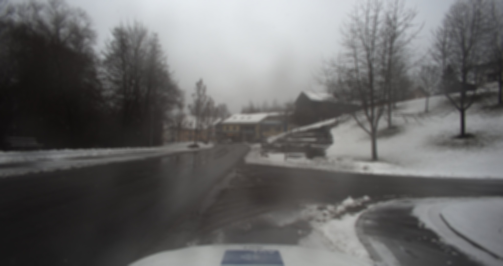
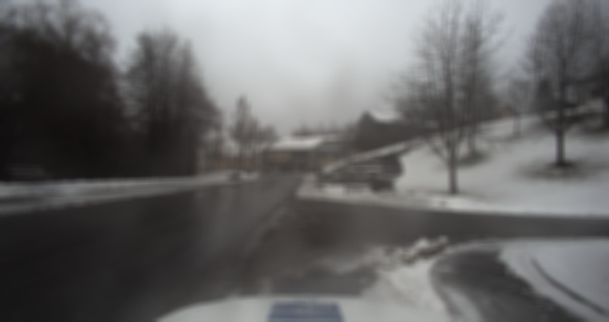
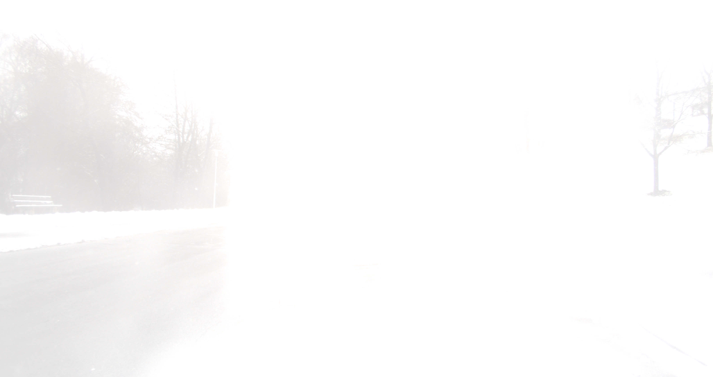

### IQA metrics run on images with non-weather related distortions

To further understand how the IQA metrics assess images, I tested them on images with synthetic distortions that aren't weather-related. I started off with the `Blur` function in Albumentations which uses a box blur. In total, I generated `13` images where I progressively increased the size of the box filter from `3` to `7` to `10` and all the way up to `51`. The following three images have the following properties: no box filter, a box filter of `27` and a box filter of `51`.

|  |
| :-------------: |
| _No blur added_ |

|    |
| :-------------------------: |
| _Blur with 27 pixel filter_ |

|        |
| :-------------------------------: |
| _Blur with 51 pixel pixel filter_ |

I then moved on to brightness and contrast and used the `RandomBrightnessContrast` function in Albumentations. While this function is fundamentally random, it's possible to get
precise values by setting `p = 1` and the ranges for the brightness and contrast to
be the same value (`brightness_limit = (x, x)` ensures that the value will be `x`).

Both `brightness_limit` and `contrast_limit` assumes a value in the range `[-1, 1]`. I progressively increased the brightness from `0` all the way up to `0.8` for `13` images. For contrast I progressively decreased the contrast from `0` to `-0.8`. Below, you can see the images with `0` added brightness, `0.4` added brightness, and `0.8` added brightness. Below that you see the same but for contrast. The values for those images are `0`, `-0.4`, `-0.8`.

|            |
| :-----------------------: |
| _No change in brightness_ |

|  |
| :-----------------------------------: |
|        _Added brightness 0.4_         |

|  |
| :-------------------------------------: |
|         _Added brightness 0.8_          |

|          |
| :---------------------: |
| _No change in contrast_ |

|  |
| :-------------------------------: |
|       _Added contrast 0.6_        |

|  |
| :---------------------------------: |
|        _Added contrast 0.8_         |

### Running the IQA metrics

Next, I ran the following metrics on the images I just generated.

```
[
  "wadiqam_nr", "hyperiqa", "arniqa-clive", "arniqa-csiq", "arniqa-flive",
  "arniqa-kadid", "arniqa-live", "arniqa-spaq", "arniqa-tid", "brisque_matlab",
  "clipiqa", "clipiqa+", "clipiqa+_rn50_512", "dbcnn", "cnniqa", "liqe",
  "maniqa", "maniqa-kadid", "maniqa-pipal", "nima", "nima-koniq", "nima-spaq",
  "nima-vgg16-ava", "nrqm", "piqe", "topiq_iaa", "topiq_iaa_res50", "topiq_nr",
  "topiq_nr-flive", "topiq_nr-spaq", "tres", "tres-flive", "unique", "clipiqa+_vitL14_512",
  "entropy", "laion_aes", "musiq", "musiq-ava", "musiq-paq2piq", "musiq-spaq",
  "paq2piq", "ilniqe", "niqe", "niqe_matlab", "pi"
]
```

After that, I plotted the results and calculated Spearman Rank Correlation Coefficients (SPRCCs) and Kendall's Tau. I got the following results:

| IQA metric           | SPRCC on blurry images | SPRCC on bright images | SPRCC on images with decreasing contrast |
| -------------------- | ---------------------- | ---------------------- | ---------------------------------------- |
| entropy              | 0.9999999999999998     | 0.9999999999999998     | 0.9999999999999998                       |
| nima-spaq            | 0.9999999999999998     | 0.9743589743589742     | 0.9999999999999998                       |
| qalign               | 0.9999999999999998     | 0.9743589743589742     | 0.9999999999999998                       |
| hyperiqa             | -0.9999999999999998    | -0.9999999999999998    | -0.9743589743589742                      |
| liqe                 | -0.9999999999999998    | -0.9743589743589742    | -0.9999999999999998                      |
| maniqa               | -0.9999999999999998    | -0.9743589743589742    | -0.9999999999999998                      |
| nima-koniq           | 0.9999999999999998     | 0.9487179487179485     | 0.9999999999999998                       |
| tres                 | -0.9743589743589742    | -0.9999999999999998    | 0.9487179487179485                       |
| unique               | 0.9230769230769229     | -0.9999999999999998    | -0.9999999999999998                      |
| clipiqa+\_rn50_512   | -0.9999999999999998    | -0.9487179487179485    | -0.846153846153846                       |
| arniqa-tid           | 0.7948717948717947     | 0.9999999999999998     | 0.9999999999999998                       |
| niqe                 | -0.9999999999999998    | -0.7435897435897434    | -0.9999999999999998                      |
| ilniqe               | -0.9743589743589742    | -0.6666666666666665    | -0.9999999999999998                      |
| pi                   | -0.9999999999999998    | -0.8205128205128204    | -0.8205128205128204                      |
| arniqa-flive         | 0.9487179487179485     | -0.6923076923076922    | 0.9487179487179485                       |
| brisque_matlab       | 0.7435897435897434     | -0.769230769230769     | -0.8974358974358972                      |
| niqe_matlab          | -0.8205128205128204    | -0.5897435897435896    | -0.9743589743589742                      |
| nima                 | 0.5897435897435896     | 0.9487179487179485     | 0.846153846153846                        |
| clipiqa              | -0.9999999999999998    | -0.8974358974358972    | -0.4102564102564102                      |
| topiq_nr-spaq        | 0.3846153846153845     | 0.846153846153846      | 0.9999999999999998                       |
| topiq_iaa            | 0.5384615384615383     | 0.8717948717948716     | 0.769230769230769                        |
| maniqa-kadid         | -0.3846153846153845    | 0.8205128205128204     | 0.9487179487179485                       |
| cnniqa               | -0.282051282051282     | -0.9743589743589742    | 0.8717948717948716                       |
| arniqa-csiq          | 0.5128205128205127     | -0.564102564102564     | 0.9999999999999998                       |
| clipiqa+             | -0.9230769230769229    | -0.282051282051282     | 0.846153846153846                        |
| musiq-paq2piq        | 0.9487179487179485     | 0.10256410256410255    | 0.9999999999999998                       |
| topiq_nr-flive       | 0.9487179487179485     | -0.05128205128205127   | 0.9999999999999998                       |
| maniqa-pipal         | -0.25641025641025633   | 0.8974358974358972     | -0.846153846153846                       |
| clipiqa+\_vitL14_512 | 0.46153846153846145    | -0.8974358974358972    | -0.6153846153846153                      |
| arniqa-spaq          | 0.025641025641025637   | 0.9487179487179485     | 0.9999999999999998                       |
| topiq_iaa_res50      | 0.4102564102564102     | 0.564102564102564      | 0.9743589743589742                       |
| dbcnn                | -0.9487179487179485    | -0.05128205128205127   | 0.846153846153846                        |
| laion_aes            | 0.564102564102564      | 0.282051282051282      | 0.9999999999999998                       |
| musiq-spaq           | 0.9487179487179485     | 0.33333333333333326    | 0.4871794871794871                       |
| paq2piq              | -0.2051282051282051    | -0.6923076923076922    | -0.769230769230769                       |
| nima-vgg16-ava       | -0.05128205128205127   | 0.5897435897435896     | 0.9999999999999998                       |
| tres-flive           | 0.5897435897435896     | -0.025641025641025637  | 0.9999999999999998                       |
| topiq_nr             | -0.769230769230769     | -0.5897435897435896    | 0.15384615384615383                      |
| wadiqam_nr           | -0.9999999999999998    | -0.17948717948717946   | 0.30769230769230765                      |
| musiq-ava            | -0.7948717948717947    | -0.025641025641025637  | -0.6666666666666665                      |
| arniqa-live          | 0.4871794871794871     | -0.17948717948717946   | 0.8205128205128204                       |
| piqe                 | 0.3846153846153845     | -0.7435897435897434    | -0.23076923076923073                     |
| musiq                | 0.4871794871794871     | 0.3846153846153845     | 0.46153846153846145                      |
| nrqm                 | 0.8205128205128204     | 0.05128205128205127    | -0.30769230769230765                     |
| arniqa-kadid         | -0.30769230769230765   | 0.5897435897435896     | -0.12820512820512817                     |
| arniqa-clive         | -0.15384615384615383   | 0.33333333333333326    | 0.5128205128205127                       |

In addition to these results I also plotted the normalized scores of each metric on each image in a scatter plot. There are too many plots to include here but they can be found at the following links: [blurry](https://drive.google.com/drive/u/0/folders/11LyLlFhb_dWAWI907SJ6R9YrX7GDrIAk), [brightness](https://drive.google.com/drive/u/0/folders/12DozWcJH935UkhXZXjsT8S-wusitVAVe), and [contrast](https://drive.google.com/drive/u/0/folders/133Y_OxuWDbcrP7ObKeeOCOen8pD4Pft0).
