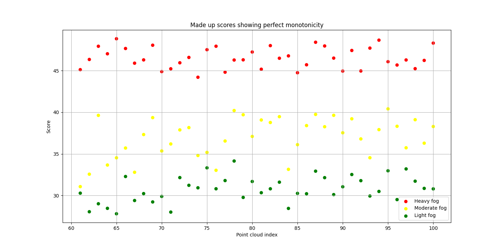
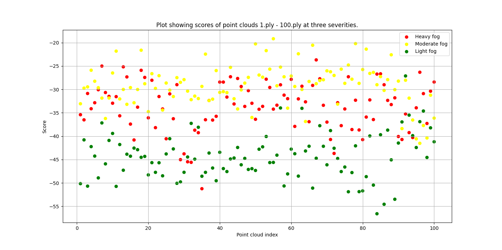

### Evaluating MM-PCQA

MM-PCQA is a promising hybrid method for PCQA and I want to see that it can accurately score point clouds from the ROADVIEW project.

So what I did was to use 100 point clouds from the first timestamped (`dgt_2025-01-08-14-37-21_0_s0`) data I found on `S3`. I chose point clouds that were in the `RTB_Lidar_All` folder. To avoid any differences due to randomness, I set `alpha`, the attenuation coefficient, to be equal to `0.01`. Usually it is randomly selected from `[0.0, 0.005, 0.01, 0.02, 0.03, 0.06]`. The reason I did this was to get deterministic results across different severity types. I chose the standard severity types in Robo3D, i.e. `light`, `moderate`, and `heavy`. This meant that I in total generated `597*3` point clouds.

Generating point clouds wasn't a problem. It actually went pretty fast to generate them all. I struggled more with running MM-PCQA on each of the point clouds. The main issue here stemmed from the fact that I ran MM-PCQA on a remote server without a display. This caused issues with Open3D. Fortunately, I could solve these issues by installing Xvfb which runs the graphical output in a virtual frame buffer. To get this working I installed it via `sudo apt-get install xvfb` and then running the commands `Xvfb :99 -screen 0 1024x768x16 &` and `export DISPLAY=:99`.

Having solved this issue, I ran MM-PCQA on all of the distorted point clouds and grouped the scores according to the following format:

```
{
    000001.ply: ["light": light_score, "moderate": moderate_score, "heavy": heavy_score]
}
```

and checked for which point clouds the scores were monotonically increasing/decreasing. A monotonic increasing score would mean `light_score <= moderate_score <= heavy_score` while a monotonically decreasing score would mean `light_score >= moderate_score >= heavy_score`. This basically checks that MM-PCQA is able to rank the quality of the point clouds correctly.

If the scores were random numbers, you would expect that `1/3` of score triplets to fulfill this criteria. This is because it's possible to order three numbers in `3! = 6` ways:

```
light_score <= moderate_score <= heavy_score
light_score <= heavy_score <= moderate_score
moderate_score <= light_score <= heavy_score
moderate_score <= heavy_score <= light_score
heavy_score <= light_score <= moderate_score
heavy_score <= moderate_score <= light_score
```

and two of these fulfill the criteria:

```
light_score <= moderate_score <= heavy_score
heavy_score <= moderate_score <= light_score
```

so you get a `2/6 = 1/3` chance of randomly getting a monotonically increasing/decreasing score (I double-checked this fact experimentally by randomly generating three numbers 10000000 times and seeing what percentage of them were monotonically increasing/decreasing. It turned out to be 34.31%).

Thus, for the MM-PCQA to be better than random. It should score rank triplets correctly more than `1/3` of the time.

Unfortunately, this does not seem to be the case. When running the code on 100 triplets of point clouds, MM-PCQA was only able to rank the 28 of them correctly. This suggests that MM-PCQA scores our point clouds no better than random.

The following is a plot of all of the scores MM-PCQA assigned for the point clouds. The x-axis is the index of the point cloud meaning that there will be three dots at each x-step (x_light_fog.ply, x_moderate_fog.ply, x_heavy_fog.ply). The y-axis is the score, red is for heavy fog, yellow is for moderate fog, and green is for light fog.

A perfect made-up scenario would look like this where green <= yellow <= red for all indices.


The actual results look like this:



While MM-PCQA only gets the rankings correct about 28% of the time, it's interesting that the ranking mismatches are usually due to the heavy and moderate fog point clouds. In the plot, we can see that overall, the light fog point clouds gets the lowest scores.
