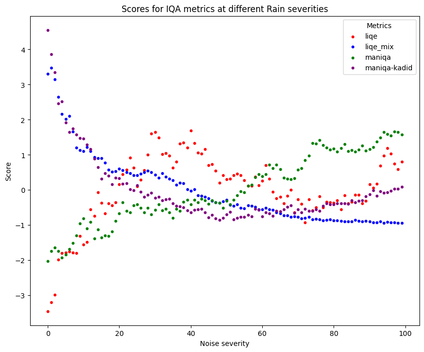
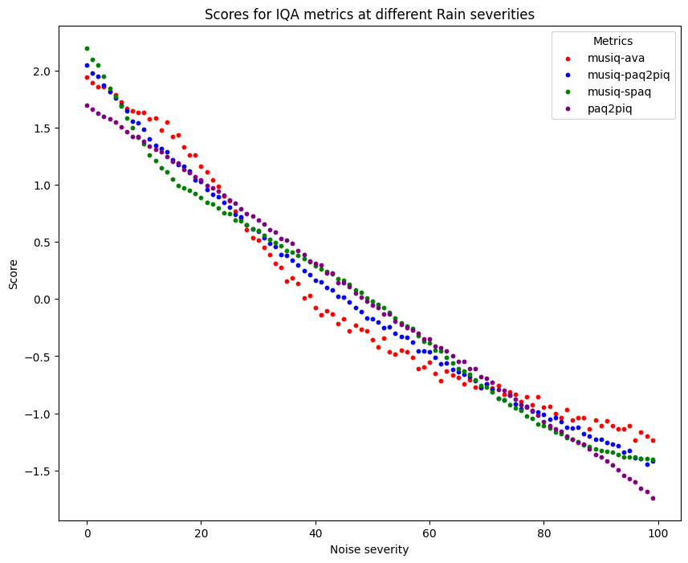
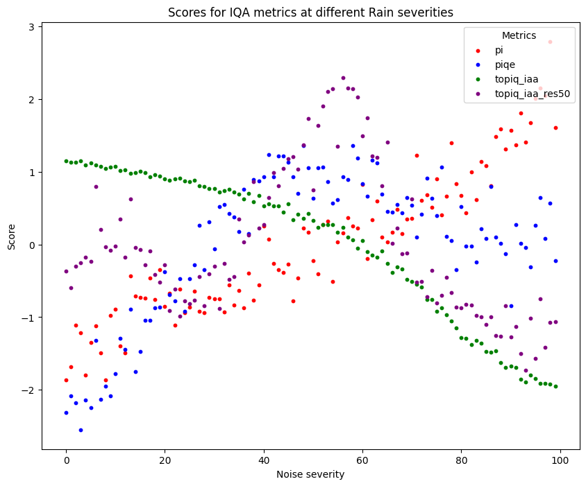

## Visualizing IQA scores
Here are the results from plotting the results from the IQA evaluations on the rainy and foggy images. The x-axis is the severity level of the added noise. The scores have been standardized using the `StandardScaler` method from `scikit-learn`. It standardizes the data so it has 0 mean and 1 in standard deviation.

**Note that 99 in noise does not mean that the image consists of 99% noise or that 0 has 0% noise! Image 0 is simply the image with least noise while 99 is the image with the most. These images can be seen further down.**

### IQA results on rainy images

Rainy image `0.png` and `99.png` looks like this:

### IQA results on foggy images
Foggy image `0.png` and `99.png` looks like this: 

