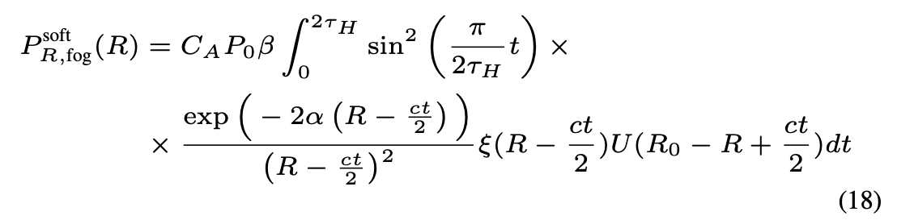

### Point cloud distortion techniques

This article has a bunch of math formulas that won't render on the blog. Use [this](https://github.com/Stenmarken/thesis-blog/blob/main/Ideas/pc_distortions/pc_distortions.md) link instead.

The problem with many PC distortion techniques is that they're tailored to one or a few datasets. [MultiCorrupt](https://github.com/ika-rwth-aachen/MultiCorrupt), which we had plans of using is tailored only to the nuScenes dataset. I've gone through the code briefly and I have no idea how I would modify to work with our dataset.

[Robo3D](https://github.com/ldkong1205/Robo3D) isn't tailored to one specific dataset but works with any dataset that has the same format as KITTI, Waymo, or nuScenes. Using Robo3D, I started off by copying the `kitti_c` folder to a new folder called `roadview_c`. To get anything running I first had to change the `fog.sh` bash script that generates the corrupted files. In the `fog.sh`, you specify the source directory, the destination directory, and `beta` which is the backscatter coefficient. In Robo3D, there are 3 values of `beta` to choose from: `[0.008, 0.05, 0.2]`. The higher the coefficient, the more severe the fog. It's only possible to have three severities since they use lookup tables of integrals for those values. If you wanted other values, then you would have to precompute integrals for those values.

Having changed the `fog.sh` script, I then made some necessary changes to the `fog_simulation.py`. The main thing I had to change here was making sure that the script read the correct files.

Finally, I created three versions of the `fog.sh` script with the three different scatter values and ran the scripts.

Having created the distorted point clouds, I visualized them in Rerun. To do this, I had to make some assumptions about the data in the point clouds. I assumed that each point was stored as `(x, y, z, intensity)` and therefore did the following transformation when reading a point cloud file.

```python
return np.fromfile(path, dtype="<f4").reshape(-1, 4)
```

Then when I send the points to Rerun, I only included the first three channels as Rerun only wants `(x, y, z)` coordinates.

The distortions seem to work rather well. The fog distortions cause points to appear right in front of the vehicle that aren't there for the undistorted point cloud. It's also clear that a larger `beta` value results in more points appearing. Below you can see four images of point clous: one that is undistorted, one with light fog (`beta = 0.008`), one with moderate fog (`beta = 0.05`), and one with heavy fog (`beta = 0.2`).

|  |
| :-----------------------------------------------: |
|                    Undistorted                    |

|  |
| :-----------------------------------: |
|               Light fog               |

|  |
| :-----------------------------------------: |
|                Moderate fog                 |

|  |
| :-----------------------------------: |
|               Heavy fog               |

There are also some issues with the fog particles changing rapidly over time. During some timestamps, the `light` fog looks very similar to the `undistorted` point cloud (see the picture of the `light` fog) only for it in the next timestamp to have a bunch of fog particles in front of the vehicle. It's possible to see this in action at this [link](https://drive.google.com/drive/u/0/folders/1hgRfwG5Oup-RjSe7DjTPg4_NTosy7ItI).

This process leaves me with two questions:

1. How difficult is it to create more than three severities of noise?
2. How serious is it that the distortions are not consistent for different point clouds?

### Understanding how Robo3D works

Understanding the inner workings of Robo3D is necessary if I want to distort point clouds with more severity levels than the three previously mentioned. I'll limit the scope to looking only at fog for now.

One thing that's unclear is that the authors specify that the authors specify that the formula for calculating a fog point is the following.

$$
\begin{equation}
\hat{\mathbf{p}} = C_{\text{fog}}(\mathbf{p}) = \begin{cases}
(\hat{p}^{x}, \hat{p}^{y}, \hat{p}^{z}, p^{i_{\text{soft}}}), & \text{if } p^{i}_{\text{soft}} > p^{i_{\text{hard}}}, \\
(p^{x}, p^{y}, p^{z}, p^{i_{\text{hard}}}), & \text{else}.
\end{cases}
\quad
\end{equation}
$$

Under clear weather, a hard target is a solid object which has an attenuation coefficient of `0`. Under foggy weather, the hard target still exists but an additional soft target is added which provides distributed scattering. Calculating the intensity of a hard target under foggy weather is done with the formula:

$$
\begin{equation}
p^{i_{\text{hard}}} = p^i e^{-2\alpha \sqrt{(p^x)^2 + (p^y)^2 + (p^z)^2}}
\quad
\end{equation}
$$

where $\alpha$ is the attenuation coefficient. Basically, under fog, the intensity of the reflected light of hard objects will decrease as the fog attenuates the signal.

The soft target has the followig formula

$$
\begin{equation}
p^{i}_{\text{soft}} = p^{i} \frac{(p^{x})^{2} + (p^{y})^{2} + (p^{z})^{2}}{\beta_{0}} - \beta \times p^{i_{\text{tmp}}} \quad (1)
\end{equation}
$$

where $\alpha$ is the attenuation coefficient, $\beta$ is the backscatter coefficient, and
$p^{i_{\text{tmp}}}$ is the received response for the soft target term. $p^{i_{\text{tmp}}}$ is precomputed using a script in the GitHub repository.

The way equation 1 works is that it calculates the intensity for the soft target, i.e. the fog, and for the hard target which is the actual point in the point cloud. Then if the resulting instensity is greater for the soft target, then it replaces the hard target point in the point cloud with the fog point.

There are three important configuration variables here: attenuation coefficient ($\alpha$), backscattering coefficient ($\beta$), and the differential reflectivity ($\beta_0$). Attenuation is the effect of the light scattering or being absorbed by the fog/rain particles in the air. A higher $\alpha$ means that more light is being absorbed/scattered. The way Robo3D implements it is that the attenuation coefficient is uniformly sampled from `[0, 0.005, 0.01, 0.02, 0.03, 0.06]`. I have to make sure that when I am distorting the point clouds, that I have the same $\alpha$ for the same point cloud at different distortion levels. Backscattering is when fog particles/rain particles cause the signal to reflect meaning that we register a "false" point in the point cloud. $\beta$ is a coefficient for how much backscattering occurs. Differential reflectivity is a measure of the variation of reflectivity based on factors like wavelength, polarization, and the angle of incidence. This is perhaps also something I have to consider in my calculations. The standard in the code is just to have it set to $3.1830988618379064e-07$.

Note that having $\alpha$ vary randomly is not good as it will provide non-deterministic results. Seeding the randomness also won't work as it's not deterministic in what exact order the point clouds are distorted. The reason for this has to with multi-threading being ultimately non-deterministic.

#### Increasing the number of distortions

Increasing the number of distortions means pre-computing the integrals for additional $\beta$ values. Why more heavy fog means a higher backscatter value but not necessarily a higher attenuation value is a question I don't know the answer to. Why not increase both the attenuation and the backscattering for more heavy fog?

Generating the precomputed integrals requires first the alpha values to include. I will not specify these and instead just use the default ones `[0.0, 0.005, 0.01, 0.02, 0.03, 0.06]`. Then I added it so you specify the beta value. Next I have to consider the `r_0_max` which is the maximum range. I had it use the default value of $200$. Next I have to specify the number of steps `n_steps`. I had it use the default again which is `arguments.n_steps = 10 * arguments.r_0_max`. It's possible to incorporate shift but I have no idea what does and it's turned off by default. Lastly, I specify the `save_path`.

In `generate_integral_lookup_table.py`, it has this statement:
`from theory import ParameterSet, P_R_fog_soft`. `theory` is not a module in the project so I changed it to `from fog_simulation import ParameterSet, P_R_fog_soft` as it is in `fog_simulation` that those methods can be found.

One weird thing is that in `fog_simulation.py`, `simulate_fog` is called with `noise` being set to `10` which is then used in `P_R_fog_soft`. This is done without any explanation. However, in `generate_integral_lookup_table.py`, it lacks a parameter for the `noise` when calling `P_R_fog_soft`, so I set that parameter to 10.

Nevermind, the problem is bigger. Calling the `P_R_fog_soft` from `generate_integral_lookup_table.py` requires a bunch of extra info. This might be difficult.

### Figuring out why Robo3D works but not LiDAR_fog_sim

The limitation of Robo3D only having three severity levels and the difficulty in generating more made me look elsewhere for LiDAR distortion code. Fortunately I found LiDAR_fog_sim, a tool for synthetically distorting point clouds with fog. It was also when looking at LiDAR_fog_sim when I realized that the Robo3D guys had simply used the code from LiDAR_fog_sim in their fog generation.

Robo3D and LiDAR_fog_sim are a bit different when it comes to fog generation. As previously mentioned, Robo3D increases the fog severity by increasing the backscattering coefficient $\beta$ while letting the attenuation coefficient $\alpha$ vary randomly (for each point cloud). LiDAR_fog_sim on the other hand has a fixed $\beta$ of $0.046 / (\text{np.log(20)} / 0.06) = 0.0009$ but increases fog severity by having a larger $\alpha$ value. Interestingly enough, the $\beta$ value is dependent on $\alpha$, however in the constructor, it sets $\alpha = 0.06$, then performs the calculation of $\beta$ and after that updates $\alpha$ to be what was inputted to the constructor. This means that the $\beta$ value is the same regardless of what $\alpha$ is.

I would like to try setting the same $\alpha$ and the same $\beta$ in LiDAR_fog_sim as in Robo3D and see that I get the same distorted point cloud out. The thing is that I don't understand how these precomputed integrals work and how they relate to different values of $\alpha$ and $\beta$.

#### How does a precomputed integral work?

Let's dig into the respective papers of Robo3D and LiDAR_fog_sim to understand how the precomptued integrals work. The integrals are calculated numerically as there is no closed form expression for them. They're used in the calculation of the attenuated fog response. The integral can be seen here:



As can be seen in the formula, the integral depends on $\alpha$ but not on $\beta$. This should hopefully mean that for different levels of $\beta$ but the same $\alpha$, I can use the same precomputed integral. This fact is also supported by the fact that when I run the following `diff` command, I get no difference:

```
diff integral_lookup_tables_seg_heavy_0.2beta/original/integral_0m_to_200m_stepsize_0.1m_tau_h_20ns_alpha_0.01.pickle integral_lookup_tables_seg_moderate_0.05beta/original/integral_0m_to_200m_stepsize_0.1m_tau_h_20ns_alpha_0.01.pickle
```

The files are from Robo3D and are computed using different beta values but the same alpha values. At the same time, in the integral generation of LiDAR_fog_sim, it doesn't just calculate the integral but the entire value of P_R_Soft which includes the value of $\beta$. How can the files then be equal if they are calculated with different $\beta$ values?

#### Weird results from the LiDAR_fog_sim

Even though LiDAR_fog_sim is used in Robo3D (which works fine), I cannot get it's distortions to work properly. For some reason, the point clouds become very strange and some points get way off. Of course, there is an option to simply generate distorted point clouds using Robo3D and progressively increase $\beta$ and leave $\alpha$ as it is. This is a bit unsatisfactory though as both $\beta$ and $\alpha$ should increase as it gets foggier (I'm assuming). Another option is to use the `theory` module in Lidar_fog_sim and simply copy that over to Robo3D and generate the integration tables for different values of alpha.

Going off that option seems to me the best, I've now copied the `theory` function to the Robo3D and that seems to get the `generate_integral_lookup_table.py` working. What I need to consider now is how to set $\alpha$ and $\beta$ for my point clouds. Perhaps I first have to understand why Robo3D and Lidar_fog_sim randomly sample $\alpha$ from `[0, 0.005, 0.01, 0.02, 0.03, 0.06]`. Furthermore, I have to understand whether or not I should decouple $\beta$ from $\alpha$ and only let the severity be determined by $\alpha$. The other option is to do what the LiDAR_fog_sim guys are doing and setting

$$\beta = \frac{0.046}{\ln(20) / \alpha}$$

Let's start with figuring out why LiDAR_fog_sim randomly samples $\alpha$. They don't provide any good explanation for why they do this in the thesis. I think the reason why they do it is simply to have some randomness in the training data when training their model to recognize objects in their foggy point clouds.

I'll now generate versions of the same point cloud where I only differ the attenuation coefficient $\alpha$ and use the following formula to calculate beta. I'll see what kind of point clouds that generates.
$$\beta = \frac{0.046}{\ln(20) / \alpha}$$
