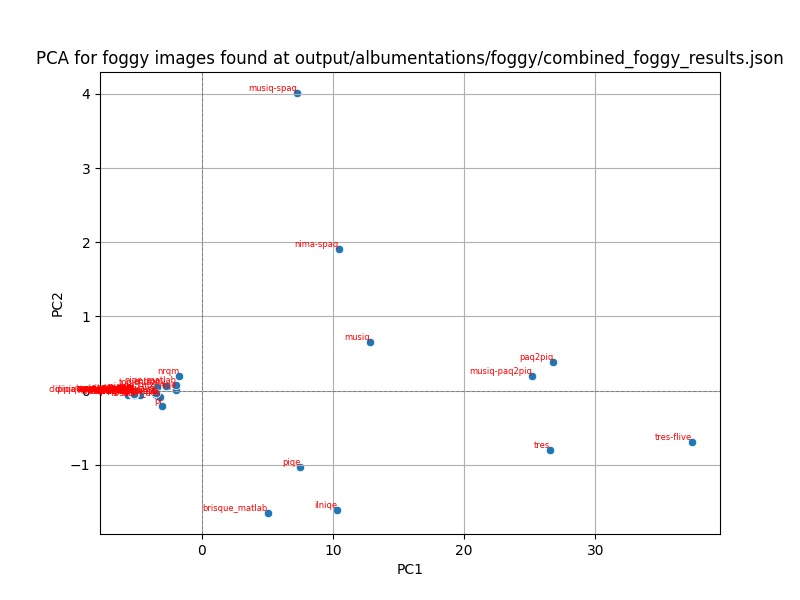
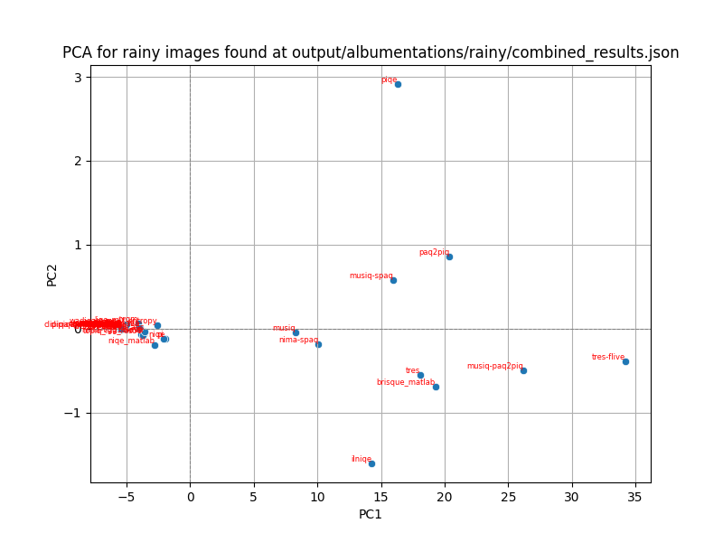

### Principal component analysis (PCA)
The idea with principal component analysis is trying to find a different view of the gathered data to more easily separate its components. PCA finds new axes which hopefully can separate tha data in a better way.

The first PC axis is found by first getting the average measurement of each data point to get the center of the data. The data is then shifted so that the center becomes the origin of the graph (note that the number of dimensions don't matter in this case). Shifting the data this way doesn't impact how the data points are positioned relative to eachother since each point is shifted an equal amount. With the data shifted, PCA tries to find the line through the origin which minimizes the distances to each data point (an equivalent option is to find the line through the origin which maximizes the distances from the projected points to the origin). The line which is added is called Principal Component 1 (PC1) and the unit vector which describes its direction is the **eigenvector** for PC1. Furthermore, the average of the sum of squares of the distances from the origin to the projected points the **eigenvalue** for PC1.

We can apply PCA to the data that I got with the evaluation of IQA methods on the rainy images. Below is a table of the results of different IQA methods for a subset of the rainy images.

Using PCA, we can look at this data in another way. We start off by loading the data from a JSON file and then scaling it using StandardScaler. This will standardize each feature (column) in the dataset to have a mean of 0 and standard deviation of 1. This is a necessary step since each IQA metric uses a different scoring system.

```python
from sklearn.preprocessing import StandardScaler
from sklearn.decomposition import PCA

metric_to_scores = load_json(path)
df = pd.DataFrame(metric_to_scores).T
scaler = StandardScaler()
X_scaled = scaler.fit_transform(df)
```

The reason for the transposition is to get the metrics as the rows and the images as the columns. I think that should create the correct set-up for the PCA. It creates a table that looks like this:

|               | 48.png    | 95.png    | 52.png    | 38.png    | 57.png    |
|---------------|-----------|-----------|-----------|-----------|-----------|
| wadiqam_nr   | -0.540695 | -0.685154 | -0.554187 | -0.514143 | -0.569280 |
| ilniqe       | 40.801331 | 46.490856 | 40.883985 | 41.443684 | 42.554152 |
| hyperiqa     | 0.365316  | 0.373250  | 0.357360  | 0.353452  | 0.357903  |
| arniqa-clive | 0.008285  | -0.017331 | 0.008504  | 0.018289  | 0.000091  |
| arniqa-csiq  | 0.422616  | 0.386815  | 0.416509  | 0.440143  | 0.413462  |


After this, we'll fit the data with two principal components so we can see the results in a graph.

```python
pca = PCA(n_components=2)
principal_components = pca.fit_transform(X_scaled)
```

With the principal components calculated, we can get the cumulative sum `explained_variance_ratio_` and see that it's `[0.99376923 0.99960736]` for **foggy images** and `[0.9969745  0.99978002]` for **rainy images**. This means that with one component, we capture more than 99% of the variance of the data.

Looking at the first principal component for both rainy and foggy images, we see an almost exact equal weighting for all images with each image contributing about `0.100`. 

Looking at a scatter plot of the data we can see the final results:


