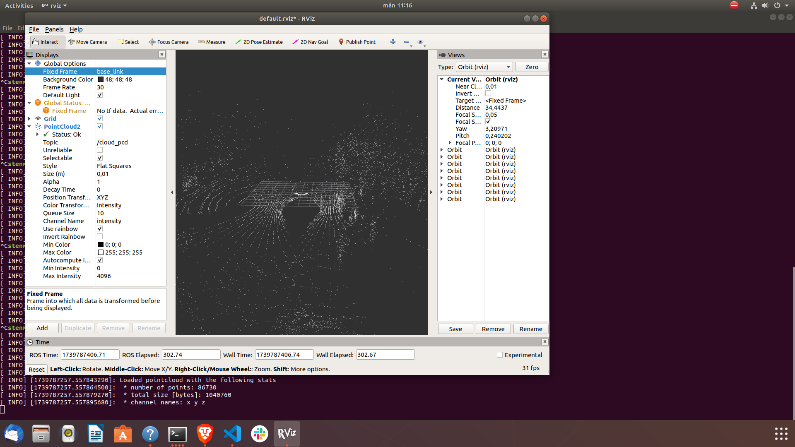

## Visualizing point clouds

To visualize point clouds, I first had to learn how they are stored on disk.

### File formats

#### PCD
One common format is the **Point Cloud Data (PCD)** format .pcd. .pcd files have the following information:
- VERSION - PCD file version
- FIELDS - This specifies the fields that exist for each point. One common one is `x y z`
- SIZE - Specifies the number of bytes used in each dimension for each point
- TYPE - Specifies the datatype for each dimension
- COUNT - Number of elements for each dimension. For our data, it will be: `1 1 1`
- WIDTH - For **unorganized** point clouds, it is equal to the number of points. For organized ones, it is the number of elements in a row. Orgaized point clouds are structured like a matrix while unorganized point clouds are stored in a random way.
- HEIGHT - Equal to 1 for unorganized point clouds. Is equal to the number of elements in a column in a organized one.
- VIEWPOINT - Used for building transforms between coordinate systems. I don't think we need to be concerned with this.
- POINTS - Number of points in the dataset.
- DATA - Data type that the PCD file is in. There is ascii, binary, and binary compressed.

After DATA, all of the point cloud data is written. A sample PCD file can look like this:
```
# .PCD v0.7 - Point Cloud Data file format
VERSION 0.7
FIELDS x y z
SIZE 4 4 4
TYPE F F F
COUNT 1 1 1
WIDTH 47013
HEIGHT 1
VIEWPOINT 0 0 0 1 0 0 0
POINTS 47013
DATA ascii
-0.4096019566 -0.5078588724 -0.0115329884
-20.36080551 -20.71806908 -0.8453675508
-20.33715057 -22.81648827 -1.489127317e-05
-20.4044075 -18.81439018 -0.3230901957
-0.39233163 -0.4859295785 0.003472482786
.
.
.
```
#### Kitti
The files of point cloud data in `S3` are .bin files stored like the ones in the
KITTI dataset. It doesn't have the same amount of metadata stored and instead only
stores `(x, y, z, r)` where `r` is the reflectance value. The reflectance value
represents the amount of light returned from the point back to the LiDAR.

#### PLY


### Visualizations

#### RViz
RViz can visualize point data but it's a bit convoluted. One way of doing it is to convert the point cloud to a rosbag which you can then visualize in RViz. I tried this according to this [tutorial](: https://www.youtube.com/watch?v=e0r4uKK1zkk) but had problems with dependencies. Also, the library used to convert a point cloud to a rosbag is specialized
for files in the KITTI dataset so I'm uncertain if it would even work with our files.

Another option is to use the [`pcd_to_pointcloud`](https://wiki.ros.org/pcl_ros#pcd_to_pointcloud) which takes in a pcd file and publishes it on a given topic. This worked fairly well! Here is a picture of the visualization. 


It looks okay but unlike Rerun, it's not easy to see point cloud data over time. To do that, I have to convert all of the pcd files to a rosbag and then run RViz on that rosbag. I managed to convert the pcd files to a rosbag but got errors when trying to run the rosbag in RViz. ROS really is a pain to use.

#### Open3D
It's possible to visualize things in Open3D directly but this is just like using Rerun with more headache. You see the same stuff and have to more of the configuring yourself.

#### Webwiz
[Webwiz](https://webviz.io/) also works with ROS data which is a bit of a hassle. I tried using the online version of the app but that didn't work unfortunately. I didn't look into Webviz a whole lot since it seems to be very similar to Rerun. So does Foxglove, which began as a fork from Webwiz and offers roughly the same service.