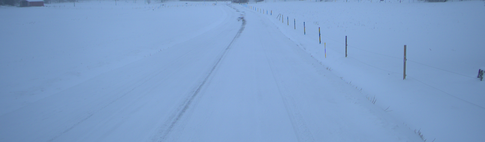

### Week 1 - 8-10 Jan

This week I spent looking at potential image quality assessment (IQA) libraries to use in the thesis. When testing a library, I used a sample dataset consisting of roughly 100 images taken from the data set `DeepLearning_Winter23_Collection10_Drive11_HilantiePohjoiseen`. I also included a few calibration images, some of whom were very sharp and others very blurry.

#### BlurDetection2
I started off with this [repo](https://github.com/WillBrennan/BlurDetection2) which is based on this [article](https://pyimagesearch.com/2015/09/07/blur-detection-with-opencv/).

It calculates blurriness using the Laplacian operator in OpenCV. The method uses a single channel of an image and convolves it using the Laplacian kernel.
$$
\begin{bmatrix}
0 & 1 & 0 \\
1 & -4 & 1 \\
0 & 1 & 0
\end{bmatrix}
$$

Then, the variance of this result is used to get a blurriness score.

This method works since the variance is a representation of the amount rapid intensity changes in the image which is a good proxy for blurriness. An image with little intensity changes has few edges and would be considered blurry,

Running the algorithm on the calibration dataset generated the following results:

* `blurry_city.jpg score: 3.4281851995379147 blurry: True`
* `BlurryDavid.jpg score: 1.1019491656728309 blurry: True`
* `sharp_landscape.jpg score: 82.32086710487695 blurry: True`
* `tree.jpg score: 298.0018283115701 blurry: False`
* `sharp_portrait.jpg score: 37.42246479517012 blurry: True`
* `other_tree.jpg score: 6344.880443954428 blurry: False`

These results are quite expected. Blurry images like blurry_city and BlurryDavid got really low scores of 3 and 1 and sharp images like sharp_landscape and sharp_portrait got high scores. 

Looking at the results on the sample dataset, we can see the problem with this approach.

This image got a score of `6.611312050611074` even though the picture is not that blurry. The reason for the low score must be that the snowy landscap creates no edges or intensity changes in the pixels which makes the algorithm think that the image is blurry.


Given that much of the dataset has snowy landscapes, this approach might not be the best to determine image quality.

#### BRISQUE
BRISQUE, originally developed in this [paper](https://live.ece.utexas.edu/publications/2012/TIP%20BRISQUE.pdf), doesn't compute classical versions of distortions like blurriness, ringing or blocking. Instead BRISQUE "uses scene statistics of locally normalized luminance coefficients to quantify possible losses of “naturalness” in the image".

First, I tried to run BRISQUE in using the pyIQA module which implements many IQA methods in python. The results using this method wasn't great. BRISQUE is supposed to generate a score from 0-100 whereas many images got scores below 0.

This could be due to the default model used in the internal BRISQUE function not having seen images that are remotely close to the images from the sample dataset. However, that seems strange considering that I got a negative value even when calculating the score for a sharp image of a tree. It's also possible that it's the noise in the images that's causing the negative values. In this [issue](https://github.com/opencv/opencv_contrib/issues/2226), a quite noisy image gets a result of -12 and when denoised, the score jumps up to about 50.

I then tried the `open-cv-contrib` module which also has an implementation of BRISQUE. The results were unfortunately not much better. I got BRISQUE values of 0 for all images in the sample dataset apart from 1. However, I did get actual results when running the code on the calibration images.

Lastly, I tried the Matlab implementation of BRISQUE and could finally get some good results.

The calibration images got sensible results with blurry images getting high scores of 64 and 49 while sharp images got scores of 7, 9, 25, and 29. The images from the sample dataset also got sensible scores ranging from 18-40.

**I've learned now that while the regular implementation of BRISQUE in pyiqa spits out weird results, there is a matlab_brisque option in pyiqa which provides good results. In fact, it gives almost the same results as the ones seen below.**

```
BRISQUE score for BlurryDavid.jpg image is: 64.8346
BRISQUE score for blurry_city.jpg image is: 49.4323
BRISQUE score for other_tree.jpg image is: 7.4223
BRISQUE score for sharp-image.jpg image is: 9.0773
BRISQUE score for sharp_landscape.jpg image is: 25.6786
BRISQUE score for sharp_portrait.jpg image is: 29.5905
BRISQUE score for tree.jpg image is: 20.3583
BRISQUE score for 1.png image is: 24.8008
BRISQUE score for 1677160695690025334.png image is: 24.8343
BRISQUE score for 1677160697290388420.png image is: 25.7383
BRISQUE score for 1677160697891049670.png image is: 25.7964
BRISQUE score for 1677160698290140531.png image is: 25.2642
BRISQUE score for 1677160704490894918.png image is: 24.8117
BRISQUE score for 1677160712290662532.png image is: 18.6199
BRISQUE score for 1677160714690221935.png image is: 21.0069
BRISQUE score for 1677160716690677182.png image is: 23.2385
BRISQUE score for 1677160719491088176.png image is: 21.317
BRISQUE score for 1677160723290827759.png image is: 21.9439
BRISQUE score for 1677160726490842226.png image is: 18.9193
BRISQUE score for 1677160737089961798.png image is: 22.5406
BRISQUE score for 1677160739090482535.png image is: 22.7168
BRISQUE score for 1677160739689877256.png image is: 23.1496
BRISQUE score for 1677160742289940689.png image is: 27.4213
BRISQUE score for 1677160742890553530.png image is: 27.0042
BRISQUE score for 1677160749690869791.png image is: 26.2593
BRISQUE score for 1677160752690801580.png image is: 25.2923
BRISQUE score for 1677160757090531022.png image is: 38.3555
BRISQUE score for 1677160760890813516.png image is: 33.773
BRISQUE score for 1677160763290072848.png image is: 33.5831
BRISQUE score for 1677160763890503050.png image is: 34.2192
BRISQUE score for 1677160765890848736.png image is: 31.5305
BRISQUE score for 1677160769690356312.png image is: 31.3203
BRISQUE score for 1677160771090473851.png image is: 29.1574
BRISQUE score for 1677160771290456063.png image is: 29.9169
BRISQUE score for 1677160776690125650.png image is: 27.9606
BRISQUE score for 1677160782489958748.png image is: 24.6952
BRISQUE score for 1677160783090912987.png image is: 24.1841
BRISQUE score for 1677160785290165581.png image is: 32.4739
BRISQUE score for 1677160785489984184.png image is: 32.2717
BRISQUE score for 1677160791489994313.png image is: 27.4446
BRISQUE score for 1677160795890546552.png image is: 26.6788
BRISQUE score for 1677160800290376423.png image is: 27.205
BRISQUE score for 1677160803490294035.png image is: 23.5696
BRISQUE score for 1677160826490424077.png image is: 28.8257
BRISQUE score for 1677160834290595276.png image is: 27.2897
BRISQUE score for 1677160836890312231.png image is: 27.3945
BRISQUE score for 1677160838490508915.png image is: 28.9779
BRISQUE score for 1677160839890172482.png image is: 26.6723
BRISQUE score for 1677160844689901349.png image is: 28.9115
BRISQUE score for 1677160848889704572.png image is: 29.3436
BRISQUE score for 1677160850290351608.png image is: 27.0659
BRISQUE score for 1677160851890104498.png image is: 27.489
BRISQUE score for 1677160856690316325.png image is: 19.5289
BRISQUE score for 1677160862690796000.png image is: 26.9162
BRISQUE score for 1677160863090421896.png image is: 27.4636
BRISQUE score for 1677160868890204905.png image is: 28.1379
BRISQUE score for 1677160869890588525.png image is: 27.3034
BRISQUE score for 1677160874890509103.png image is: 24.6905
BRISQUE score for 1677160877490856401.png image is: 23.2724
BRISQUE score for 1677160878489998438.png image is: 26.4687
BRISQUE score for 1677160881090709310.png image is: 26.9349
BRISQUE score for 1677160883890494780.png image is: 27.9636
BRISQUE score for 1677160892890641143.png image is: 29.1603
BRISQUE score for 1677160898689976274.png image is: 27.3004
BRISQUE score for 1677160905890587082.png image is: 26.9903
BRISQUE score for 1677160907690497435.png image is: 27.8743
BRISQUE score for 1677160910689933973.png image is: 28.5248
BRISQUE score for 1677160912890266484.png image is: 29.568
BRISQUE score for 1677160930690701993.png image is: 26.5693
BRISQUE score for 1677160931690434839.png image is: 26.334
BRISQUE score for 1677160933291265694.png image is: 24.6336
BRISQUE score for 1677160937289884008.png image is: 26.9356
BRISQUE score for 1677160937691206278.png image is: 27.0068
BRISQUE score for 1677160939090399354.png image is: 27.7005
BRISQUE score for 1677160946890728113.png image is: 29.1984
BRISQUE score for 1677160950290817873.png image is: 29.2886
BRISQUE score for 1677160952490748079.png image is: 29.8156
BRISQUE score for 1677160962690647034.png image is: 27.3692
BRISQUE score for 1677160973490134184.png image is: 25.7142
BRISQUE score for 1677160975290412297.png image is: 31.2406
BRISQUE score for 1677160975689944585.png image is: 31.2184
BRISQUE score for 1677160977089617413.png image is: 32.5264
BRISQUE score for 1677160984490641494.png image is: 29.5504
BRISQUE score for 1677160995089297490.png image is: 30.1632
BRISQUE score for 1677161006290323397.png image is: 30.1688
BRISQUE score for 1677161008490317348.png image is: 29.6223
BRISQUE score for 1677161009290668482.png image is: 30.2141
BRISQUE score for 1677161012490991314.png image is: 29.2236
BRISQUE score for 1677161012890464805.png image is: 29.4193
BRISQUE score for 1677161021689917742.png image is: 28.8487
BRISQUE score for 1677161021890302522.png image is: 28.7449
BRISQUE score for 1677161026890684287.png image is: 29.6932
BRISQUE score for 1677161035690518751.png image is: 25.5146
BRISQUE score for 1677161037490515458.png image is: 25.3718
BRISQUE score for 1677161039690275643.png image is: 24.5875
BRISQUE score for 1677161040290408060.png image is: 23.8211
BRISQUE score for 1677161041490551019.png image is: 22.1264
BRISQUE score for 1677161043689937805.png image is: 25.3122
BRISQUE score for 1677161045689804340.png image is: 22.5196
BRISQUE score for 1677161046290529358.png image is: 22.4608
BRISQUE score for 1677161046690512547.png image is: 24.1777
BRISQUE score for 1677161063290193627.png image is: 29.7873
BRISQUE score for 1677161063890348275.png image is: 29.0193
BRISQUE score for 1677161075090710445.png image is: 25.7094
BRISQUE score for 1677161075290240624.png image is: 25.7688
BRISQUE score for 1677161076690507486.png image is: 23.7347
BRISQUE score for 1677161085690019662.png image is: 25.8608
BRISQUE score for 1677161095290287409.png image is: 25.0919
BRISQUE score for 2.png image is: 33.8089
BRISQUE score for 3.png image is: 29.5505
BRISQUE score for 4.png image is: 25.6488
BRISQUE score for 5.png image is: 21.2207
BRISQUE score for 6_1.png image is: 24.2022
BRISQUE score for 6_2.png image is: 23.5205
```


