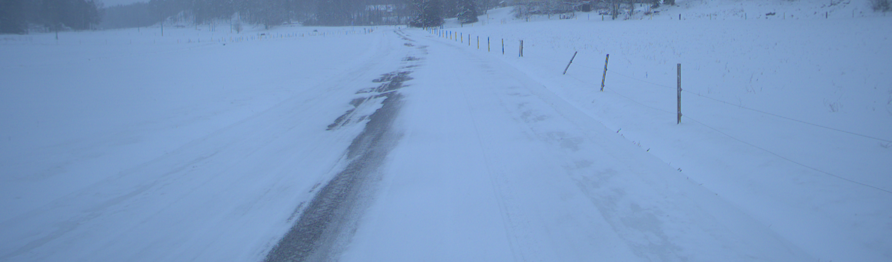

### Week 2 - 13-17 January

In this week, I'll continue to look at some IQA repos and methods.

### NIQE
NIQE or Natural Image Quality Evaluator that is similar to BRISQUE 
in that it measures deviations from statistical regularities observed in regular images.
Just like with BRISQUE, a low score is good while a high score indicates that the image
is of low quality.

NIQE is implemented in the pyiqa module. Running the code on the sample dataset used
in Week 1 and the default model generated decent results.

The blurry calibration images generally get high scores and the sharp calibration images get low scores as can be seen below

* `BlurryDavid.jpg: 12.91849876776203`
* `blurry_city.jpg: 6.5607925269637795`
* `sharp-image.jpg: 5.291517657796554`
* `tree.jpg: 2.9092264900807265`
* `sharp_portrait.jpg: 3.4475527813987914`

However, it works quite badly on the dataset of self-driving images.

The images generally get scores of 7-12 which is not, in my opinion, indicative of their actual quality.

Compare the following two images. They get roughly the same scores: 12.91849876776203 and
12.699591838465812 but the first one is clearly more blurry than the latter. 




Thus, NIQE with the default model doesn't seem to perform great. However, it's possible that the results would be much better with a customized model.

### Other IQA methods
I was looking over the number of metrics available in the pyiqa module and it's too many to keep track of.
```python
>>> pyiqa.list_models()
['ahiq', 'arniqa', 'arniqa-clive', 'arniqa-csiq', 'arniqa-flive', 'arniqa-kadid', 'arniqa-live', 'arniqa-spaq', 'arniqa-tid', 'brisque', 'brisque_matlab', 'ckdn', 'clipiqa', 'clipiqa+', 'clipiqa+_rn50_512', 'clipiqa+_vitL14_512', 'clipscore', 'cnniqa', 'cw_ssim', 'dbcnn', 'dists', 'entropy', 'fid', 'fsim', 'gmsd', 'hyperiqa', 'ilniqe', 'inception_score', 'laion_aes', 'liqe', 'liqe_mix', 'lpips', 'lpips+', 'lpips-vgg', 'lpips-vgg+', 'mad', 'maniqa', 'maniqa-kadid', 'maniqa-pipal', 'ms_ssim', 'msswd', 'musiq', 'musiq-ava', 'musiq-paq2piq', 'musiq-spaq', 'nima', 'nima-koniq', 'nima-spaq', 'nima-vgg16-ava', 'niqe', 'niqe_matlab', 'nlpd', 'nrqm', 'paq2piq', 'pi', 'pieapp', 'piqe', 'psnr', 'psnry', 'qalign', 'qalign_4bit', 'qalign_8bit', 'ssim', 'ssimc', 'stlpips', 'stlpips-vgg', 'topiq_fr', 'topiq_fr-pipal', 'topiq_iaa', 'topiq_iaa_res50', 'topiq_nr', 'topiq_nr-face', 'topiq_nr-flive', 'topiq_nr-spaq', 'tres', 'tres-flive', 'unique', 'uranker', 'vif', 'vsi', 'wadiqam_fr', 'wadiqam_nr']
```

Sure, many of these are FR metrics (meaning that they require reference images) which means that they won't be applicable to this project. But there are many NR metrics and it's going to take some time understanding which of them are suitable, and which aren't. I ran the models I could get working on the `sample_imgs` dataset and logged the results. A more detailed explanation of the runthrough can be found [here](../../Code/pyiqa.md). 

One difficulty though with comparing images is that many methods can be specified with an NSS model or machine learning model. For instance, the NIQE method can be specified with a NSS model that is used to calculate the statistical deviations of the distorted images. This means that if I get poor results on my images, then it could mean that NIQE is an unsuitable method or that I need a better NSS model. This is going to be hard to determine.

Perhaps a good approach is finding some SOTA metric and then re-training its machine learning model using images taken from self-driving?
