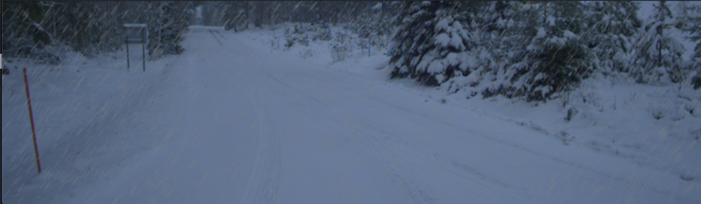

### Week 3 - 20-24 January

#### Libraries for image distortions
Last week I tinkered with the `imagecorruptions` library in python to create distorted images. 
It's quite a nice library since it can add noise that occur in images taken by 
AV sensors. It can add motion, defocus, and zoom blurs as well as add 
noise simulating snow, frost, brightness, and fog. This is all well 
and good but the problem with the library is that it can only add 
5 levels of noise to an image. This means that for any given noise, 
you can only get back 5 images with different levels of that noise. 
Ideally you'd want to be able to take an image and a noise type and 
generate 100 images with various amounts of that noise type. Thus, 
I decided to look at some alternatives to `imagecorruptions` and see 
if those offered this feature. Here are some alternatives:

#### Wand
Wand is a python-binding for ImageMagick, a tool for editing 
and manipulating digital images. It has many features for distorting 
images but they consist mainly of mathematical functions. It's possible 
to do affine transformations, scalings, rotations, translations, and rezizings. 
However, it's not possible to directly add things like motion blur or snow noise. 
It's much more low-level than this.

I guess that it's an option to implement various blurs/distortions 
myself using Wand but it would most likely take some time. 
I would also have to get in the weeds of understanding how all of the distortions 
work (and cover things like images of different sizes). Ultimately, I'm not super 
excited about that and I won't get into it unless I have to. And if I do have to 
implement the noise types myself then I perhaps I don't even need Wand. 
It might be the case that all the noise types can be implemented 
using just `cv2`, `numpy`, and `pillow`.

#### Albumentations
Albumentations is a library meant for creating image augmentation pipelines.
It has many possibilities when it comes to adding noise including ones for weather
related noise. You can add snow, rain, fog, sunflares, and change the brightness plus
contrast. This is all great but the library is stochastic at its core meaning that
it's quite difficult to add the exact amount of noise that you want. For instance,
for the `RandomRain` augmentation, it's possible to set the slant of the rain drops,
their size, and their color but it's not possible to set the rain droplets positions
deterministically. Even if I seed the randomness, running the code again will change
the positions of the droplets.

However, there is also an option for functional transforms where you can specify every parameter. This is great but the functional transforms also require you to input a list of 
all the coordinates of snow, fog, rain particles which is not ideally what I want. But what I could do is generate a list of points of rain/snow using the `RandomRain` augmentation, save those points and then use them in the functional transforms. The only problem with this
approach is that I need to do this process for every image with different dimensions.

I might also just use the basic version of the library and disregard the fact that the results aren't reproducible. If you set the parameters to be the same, then the images will basically be the same. Consider the following two images that were generated with the same parameters:

The quality is the same, it's just that the raindrops appear in slightly different positions.

#### AugLy
AugLy is an augmentation library that can be used for text, image, and video data.
However, I don't see an easy way of adding weather related noise so I won't investigate
this library further.

#### imgaug
imgaug is a python augmentation library that in many ways are similar to Albumentations.
It's possible to create snowy landscapes, clouds, fog, rain, and snowflakes on images
just like in Albumentations. From what I've read, you can basically do the same things
in imgaug that you can in Albumentations but that Albumentations is faster. 

