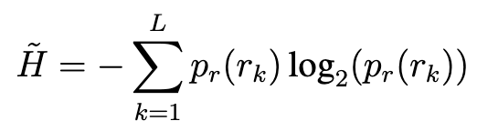

## Week 8 24-28 Feb

This week I've mainly been writing the background chapter for my thesis. Among other things, I've been looking at the no-reference image quality assessment techniques that I'll use in my evaluation. As there is literally hundreds of papers on the subject, I couldn't include all of them in the chapter. Instead, I wrote about the main approaches that IQA techniques over the years have used. Here is a short summary of each one.

### Distortion-specific IQA

The early researchers of image quality assessment were mainly interested in specific distortions that occurred through compression algorithms. Two distortions that researchers were keen on detecting were blockiness and blurriness that happened when images were compresed via JPEG.

#### Natural scene statistics (NSS)

Later on, researchers sought to expand the field of IQA by evaluating distorted images with unknown types of distortion. A key insight that spurred development was that natural high-quality images have certain statistical properties and distortions cause deviations from those properties. A key technique using NSS is BRISQUE which computes Mean Subtracted Contrasted Normalized (MSCN) coefficients for an image and compares those MSCN coefficients to a specific Gaussian-like distribution that natural high-quality images follow.

Another technique is to measure the entropy in an image, that is the randomness or unpredictability of pixel intensities. The formula can be seen below:

Here p_r(r_k) is the probability of the pixel intensity r_k occurring in the image. Interestingly, while this metric is very simple, it performed very well on the dataset of rainy and foggy images where I progressively added fog and rain to the same image going from 0% to 100%. Below you can see the plot of how the entropy metric scored.

We can see that the entropy goes down as the amount of rain/fog increases. This makes a lot of sense. The fog and the rain particles have the same pixel intensities so when I add more rain or fog, the entropy will decrease. I wonder if entropy would work as well as an IQA metric if the rain had slightly different pixel intensities.

#### Deep learning

One limitation of NSS-based methods is their reliance on hand-crafted features for quality assessment. As a result, they perform well on certain types of distortions but struggle to accurately score images affected by a wider range of distortions.

#### CNNs

Later methods therefore used deep learning approaches for IQA where they didn't have to rely on hand-crafted features. CNNIQA used a convolutional neural network (CNN) for IQA and outperformed BRISQUE on a number of datasets.

Introducing deep learning models poses a problem though. Complicated deep learning models require large datasets and those are expensive to produce (as they require human subjects). RankIQA addressed this issue by generating pairs of images with unknown absolute scores but a known ranking, allowing the network to determine which image is better within each pair. WaDIQaM overcame this issue by instead training on smaller patches of images which increased the amount of training data.

#### CLIP-based approaches

CLIP is a neural network developed by OpenAI that used Contrastive Representation Learning (CRL) on 400 million pairs of images and text snippets. It was trained by embedding images and text snippets into the same embedding space. The goal of CRL is to find a good embedding so that similar image-text pairs have similar embeddings in the embedding space while dissimilar ones are far apart. Basically, if you have an image of a Ferrari and a text snippet of "photo of a Ferrari", you want them close together in the embedding space.

Using CLIP, the authors of CLIP-IQA were able to create an IQA technique by embedding the image into the embeding space and calculating how close they are (using cosine similarity) to the text-snippets "good photo" and "bad photo". This is quite a simple approach that achieves good results and it doesn't require training on human mean opinion scores.

### Large Multimodality Models (LMMs)

With the rise of LMMs, some researchers have adapted them to handle image-quality assessment. The authors of Q-align, an LMM for IQA, noted that LMMs are better at scoring images using discrete text labels like "good", "poor", "excellent" than scoring using a specific number. They used this insight to convert human opinion scores of NR-IQA datasets to discrete text labels and used this data on the mPLUG-Owl-2 LMM. The results are very promising and Q-align scored very well on my dataset 0-100% rain/fog noise.

